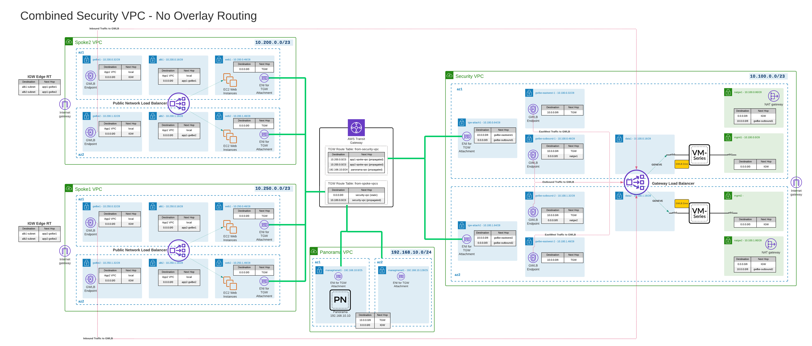
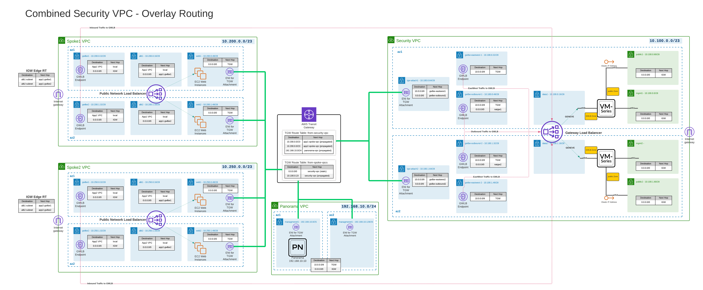

# 1. Warning

----------
This repository and lab guide are intended to be used with a specific QwikLabs scenario, and some steps are specific to Qwiklabs. It contains deployment code and lab guide for learning GWLB traffic flows with VM-Series. Some configuration and resources are intentionally ommitted to be left as troubleshooting excercises. 

***Do not use this for a production deployment or an easy demo environment!***

You can find the regularly maintained terraform modules and example deployments for your production deployments at [pan.dev](https://pan.dev/terraform/docs/swfw/aws/vmseries/overview/). These module are also published on the [HashiCorp Registry](https://registry.terraform.io/modules/PaloAltoNetworks/swfw-modules/aws/latest).

The [Combined Design](https://pan.dev/terraform/docs/swfw/aws/vmseries/reference-architectures/centralized_design/) example closely matches the design from this learning lab.

----------


# 2. VM-Series on AWS Gateway Load Balancer Lab

```
Manual Last Updated: 2024-07-11
Lab Last Tested: 2024-07-11
```

## 2.1. Overview


This lab will involve deploying Palo Alto Networks VM-Series in AWS with a Gateway Load Balancer (GWLB) topology. You will first deploy a Panorama and then the rest of the AWS resources and VM-Series with bootstrapping. It is a challenge lab that will require you to troubleshoot and fix some issues.


## 2.2. Lab Guide Syntax conventions

- Items with a bullet indicate actions that need to be taken to complete the lab. They are sometimes followed with a code block for copy / paste or reference.
```
Example Code block following an action item
```

> &#8505;  Items with info icon are additional context or details around actions performed in the lab

> &#10067; Items with question mark icon are questions that should be answered on the quiz

Use the corresponding [quiz](https://docs.google.com/forms/d/e/1FAIpQLSfkJdW2cz8kurjB0n7M-WvFOaqfRCuY6OemWf6okQheGO5LMQ/viewform) that relates to the questions you will see inside this guide to test your knowledge!

## 2.3. Table of Contents

- [1. Warning](#1-warning)
- [2. VM-Series on AWS Gateway Load Balancer Lab](#2-vm-series-on-aws-gateway-load-balancer-lab)
  - [2.1. Overview](#21-overview)
  - [2.2. Lab Guide Syntax conventions](#22-lab-guide-syntax-conventions)
  - [2.3. Table of Contents](#23-table-of-contents)
- [3. Lab Topology](#3-lab-topology)
  - [3.1. Flow Diagrams](#31-flow-diagrams)
    - [3.1.1. Outbound Traffic Flows](#311-outbound-traffic-flows)
    - [3.1.2. Inbound Traffic Flows](#312-inbound-traffic-flows)
- [4. Lab Steps](#4-lab-steps)
  - [4.1. Initialize Lab](#41-initialize-lab)
    - [4.1.1. Find SSH Key Pair Name](#411-find-ssh-key-pair-name)
  - [4.2. Update IAM Policies](#42-update-iam-policies)
  - [4.3. Check Marketplace Subscriptions](#43-check-marketplace-subscriptions)
  - [4.4. Launch CloudShell](#44-launch-cloudshell)
  - [4.5. Search Available VM-Series Images (AMIs)](#45-search-available-vm-series-images-amis)
  - [4.6. Download Terraform](#46-download-terraform)
  - [4.7. Clone Deployment Git Repository](#47-clone-deployment-git-repository)
  - [4.8. Deploy Panorama and TGW Infrastructure with Terraform](#48-deploy-panorama-and-tgw-infrastructure-with-terraform)
  - [4.9. Prepare Panorama](#49-prepare-panorama)
  - [4.10. Update Deployment Values in tfvars for VM-series](#410-update-deployment-values-in-tfvars-for-vm-series)
  - [4.11. Apply Terraform](#411-apply-terraform)
  - [4.12. Inspect deployed resources](#412-inspect-deployed-resources)
    - [4.12.1. Get VM-Series instance screenshot](#4121-get-vm-series-instance-screenshot)
    - [4.12.2. Check VM-Series instance details](#4122-check-vm-series-instance-details)
    - [4.12.3. Check cloudwatch bootstrap logs](#4123-check-cloudwatch-bootstrap-logs)
  - [4.13. Verify Bootstrap in Panorama](#413-verify-bootstrap-in-panorama)
  - [4.14. Access VM-Series Management](#414-access-vm-series-management)
  - [4.15. Check bootstrap logs](#415-check-bootstrap-logs)
  - [4.16. Fix GWLB Health Probes](#416-fix-gwlb-health-probes)
  - [4.17. Inbound Traffic Flows to App Spoke VPCs](#417-inbound-traffic-flows-to-app-spoke-vpcs)
    - [4.17.1. Update Spoke1 App VPC networking for Inbound inspection with GWLB](#4171-update-spoke1-app-vpc-networking-for-inbound-inspection-with-gwlb)
    - [4.17.2. Update Spoke2 App VPC networking for Inbound inspection with GWLB](#4172-update-spoke2-app-vpc-networking-for-inbound-inspection-with-gwlb)
    - [4.17.3. Test Inbound Traffic to Spoke Web Apps](#4173-test-inbound-traffic-to-spoke-web-apps)
    - [4.17.4. Test Outbound Traffic from Spoke1 Instance](#4174-test-outbound-traffic-from-spoke1-instance)
    - [4.17.5. Check Inbound Traffic Logs](#4175-check-inbound-traffic-logs)
    - [4.17.6. Check Outbound Traffic Logs](#4176-check-outbound-traffic-logs)
  - [4.18. Outbound and East / West (OBEW) Traffic Flows](#418-outbound-and-east--west-obew-traffic-flows)
    - [4.18.1. Update Spoke1 VPC for OB/EW routing with TGW](#4181-update-spoke1-vpc-for-obew-routing-with-tgw)
    - [4.18.2. Update Spoke2 VPC for OB/EW routing with TGW](#4182-update-spoke2-vpc-for-obew-routing-with-tgw)
    - [4.18.3. Update Transit Gateway (TGW) Route Tables](#4183-update-transit-gateway-tgw-route-tables)
    - [4.18.4. Update Security VPC networking for OB/EW with GWLB](#4184-update-security-vpc-networking-for-obew-with-gwlb)
  - [4.19. Test Traffic Flows](#419-test-traffic-flows)
    - [4.19.1. Test Outbound Traffic from Spoke1 Instances](#4191-test-outbound-traffic-from-spoke1-instances)
    - [4.19.2. Test Inbound Web Traffic to Spoke1 and Spoke2 Apps](#4192-test-inbound-web-traffic-to-spoke1-and-spoke2-apps)
    - [4.19.3. Test E/W Traffic from Spoke1 Instance to Spoke2 Instance](#4193-test-ew-traffic-from-spoke1-instance-to-spoke2-instance)
  - [4.20. GWLBE / Sub-Interface associations](#420-gwlbe--sub-interface-associations)
    - [4.20.1. Configure Zones in Panorama](#4201-configure-zones-in-panorama)
    - [4.20.2. Configure Sub-Interfaces in Panorama](#4202-configure-sub-interfaces-in-panorama)
    - [4.20.3. Create associations from GWLB Endpoints](#4203-create-associations-from-gwlb-endpoints)
    - [4.20.4. Create Zone-Based policies for sub-interfaces](#4204-create-zone-based-policies-for-sub-interfaces)
  - [4.21. Overlay Routing](#421-overlay-routing)
    - [4.21.1. Create Public Interfaces for VM-Series](#4211-create-public-interfaces-for-vm-series)
    - [4.21.2. Associate the EIPs to the Public Interfaces](#4212-associate-the-eips-to-the-public-interfaces)
    - [4.21.3. Configure Networking and Policies in Panorama](#4213-configure-networking-and-policies-in-panorama)
    - [4.21.4. Enable Overlay mode](#4214-enable-overlay-mode)
    - [4.21.5. Test Outbound Traffic](#4215-test-outbound-traffic)
  - [4.22. Review Lab Quiz Questions](#422-review-lab-quiz-questions)
  - [4.23. Finished](#423-finished)

# 3. Lab Topology



## 3.1. Flow Diagrams

Reference these diagrams for a visual of traffic flows through this topology.
### 3.1.1. Outbound Traffic Flows


### 3.1.2. Inbound Traffic Flows


# 4. Lab Steps
## 4.1. Initialize Lab

- Download `Student Lab Details` File from Qwiklabs interface for later reference
- Click Open Console and authenticate to AWS account with credentials displayed in Qwiklabs
- Verify your selected region in AWS console (top right) matches the aws-gwlb-lab-secrets.txt
- Open the [quiz](https://docs.google.com/forms/d/e/1FAIpQLSfkJdW2cz8kurjB0n7M-WvFOaqfRCuY6OemWf6okQheGO5LMQ/viewform) to answer questions as you go through the guide
  
### 4.1.1. Find SSH Key Pair Name

- EC2 Console -> Key pairs
- Copy and record the name of the Key Pair that was generated by Qwiklabs, e.g. `qwikLABS-L17939-10286`
- In Qwiklabs console, download the ssh key for later use (PEM and PPK options available)

> &#8505; Any EC2 Instance must be associated with a SSH key pair, which is the default method of initial interactive login to EC2 instances. With successful bootstrapping, there should not be any need to connect to the VM-Series instances directly with this key, but it is usually good to keep this key securely stored for any emergency backdoor access. 
> 
> For this lab, we will use the key pair automatically generated by Qwiklabs. The key will also be used for connecting to the test web server instances.


## 4.2. Update IAM Policies


- Search for `IAM` in top search bar (IAM is global)
- In IAM dashboard select Users -> awsstudent
- Expand `default_policy`, Edit Policy -> Visual Editor
- Find the Deny Action for `Cloud Shell` and click `Remove` on the right
- Also remove the Deny actions for all actions containing `Marketplace`
- Select `Review policy`
- Select `Save changes`

---


> &#8505; Qwiklabs has an explicit Deny for CloudShell. However, we have permissions to remove this deny policy. Take a look at the other Deny statements while you are here.

> &#8505; It is important to be familiar with IAM concepts for VM-Series deployments. Several features (such as bootstrap, custom metrics, cloudwatch logs, HA, VM Monitoring) require IAM permissions. You also need to consider IAM permissions in order to deploy with IaC or if using lambda for custom automation.

---

## 4.3. Check Marketplace Subscriptions

> &#8505; Before you can launch VM-Series or Panorama images in an account, the account must first have accepted the Marketplace License agreement for that product.

> &#8505; The QwikLabs accounts should already be subscribed to these offers, but we will need to verify and correct if required.

- Search for `AWS Marketplace Subscriptions` in top search bar
- Verify that there are active subscription for both of:
  - `VM-Series Next-Generation Firewall (BYOL)`
  - `Palo Alto Networks Panorama`


- If you have both subscriptions, continue to the next section
- If you are missing either subscription, select `Discover Products` and search for `palo alto`
- Select `VM-Series Next-Generation Firewall (BYOL)` or `Palo Alto Networks Panorama` as needed
- Continue to Subscribe
- Accept Terms
- Allow a few moments for the Subscription to be processed
- Repeat for the other Subscription if needed
- Exit out of the Marketplace
- Notify lab instructor if you have any issues

---

## 4.4. Launch CloudShell

- *Verify you are in the assigned region!*
- Search for `cloudshell` in top search bar
- Close out of the Intro Screen
- Allow a few moments for it to initialize

---

> &#8505; This lab will use cloudshell for access to AWS CLI and as a runtime environment to provision your lab resources in AWS using terraform. Cloudshell will have the same IAM role as your authenticated user and has some utilities (git, aws cli, etc) pre-installed. It is only available in limited regions currently.
>
> Anything saved in home directory `/home/cloudshell-user` will remain persistent if you close and relaunch CloudShell

---

## 4.5. Search Available VM-Series Images (AMIs)

> &#8505; We will use us-west-2 for example of using this search and answering the questions, but your actual deployment for this lab may be in a different region.

- In cloud console, enter:

```
aws ec2 describe-images --filters "Name=owner-alias,Values=aws-marketplace" --filters Name=name,Values=PA-VM-AWS-10* Name=product-code,Values=6njl1pau431dv1qxipg63mvah --region us-west-2
```

- Press space a few times to page down

- Try using query to control what data is returned

```
aws ec2 describe-images --filters "Name=owner-alias,Values=aws-marketplace" --filters Name=name,Values=PA-VM-AWS-10* Name=product-code,Values=6njl1pau431dv1qxipg63mvah --region us-west-2 --query 'Images[].[ImageId,Name]'
```

- We see that `10.2.3` AMI is available, which is what we are targeting for this deployment


> &#10067; What is the BYOL Marketplace AMI ID for 10.2.0 in the us-east-1 region?

> &#10067; What are some options if there is no AMI available for your targeted version?

---

> &#8505;  This terraform deployment will look up the AMI ID to use for the deployment based on the variable `fw_version`. New AMIs are not always published for each minor release. Therefore, it is a good idea to verify what version AMI most closely matches your target version.

> &#8505; product-code is a global value that correlates with Palo Alto Networks marketplace offerings This is global and the same across all regions. There will be changes to this as vm-flex offerings come live. ##TODO
>```
>   "byol"  = "6njl1pau431dv1qxipg63mvah"
>   "payg1" = "6kxdw3bbmdeda3o6i1ggqt4km"
>   "payg2" = "806j2of0qy5osgjjixq9gqc6g"
>```

> &#8505; The name tag of the image should be standard and can be used for the filter. For example `PA-VM-AWS-10.1*`, `PA-VM-AWS-9.1.3*`, `PA-VM-AWS-10*`. This is the same logic the terraform will use to lookup the AMI based on the `fw_version` variable.

> &#8505; Not needed for this lab, but when deploying VM-Series from EC2 console, it will default to the latest version. You can instead go to the AWS Marketplace to subscribe to the offering and select previous versions to deploy the desired AMI
> 
> 

---


## 4.6. Download Terraform 

- Make sure CloudShell home directory is clean

```
rm -rf ~/bin && rm -rf ~/lab-aws-gwlb-vmseries/
```

- Download Terraform in Cloudshell

```
mkdir /home/cloudshell-user/bin/ && wget https://releases.hashicorp.com/terraform/1.3.9/terraform_1.3.9_linux_amd64.zip && unzip terraform_1.3.9_linux_amd64.zip && rm terraform_1.3.9_linux_amd64.zip && mv terraform /home/cloudshell-user/bin/terraform
```

- Verify Terraform 1.3.9 is installed
```
terraform version
```

> &#8505; Terraform projects often have version constraints in the code to protect against potentially breaking syntax changes when new version is released. For this project, the [version constraint](https://github.com/PaloAltoNetworks/lab-aws-gwlb-vmseries/blob/main/terraform/vmseries/versions.tf) is:
> ```
> terraform {
>  required_version = ">=0.12.29, <2.0"
>}
>```
>
>Terraform is distributed as a single binary so isn't usually managed by OS package managers. It simply needs to be downloaded and put into a system `$PATH` location. For Cloudshell, we are using the `/home/cloud-shell-user/bin/` so it will be persistent if the sessions times out.


## 4.7. Clone Deployment Git Repository 

- Clone the Repository with the terraform to deploy
  
```
git clone https://github.com/PaloAltoNetworks/lab-aws-gwlb-vmseries.git && cd lab-aws-gwlb-vmseries/terraform/panorama
```

## 4.8. Deploy Panorama and TGW Infrastructure with Terraform

- Make sure you are in the appropriate deployment directory

```
cd ~/lab-aws-gwlb-vmseries/terraform/panorama
```
- Initialize Terraform

```
terraform init
```

- Apply Terraform

```
terraform apply
```

- When Prompted for confirmation, type `yes`

- It should take a few minutes minutes for terraform to finish deploying all resources

- When complete, you will see an output containing the Panorama URL. **Copy these locally so you can reference them in later steps**

> &#8505; You can also come back to this directory in CloudShell later and run `terraform output` to view this information 

- It will be about 7 minutes from the time the Terraform finishes before you can access and authenticate to the Panorama.

## 4.9. Prepare Panorama

> &#8505; The Panorama was deployed from a partially prepped image that is licensed and has some baseline template, devicegroup, and logging configured. Additional steps will be completed here to prepare the Panorama for bootstrapping.

- Copy the `panorama_url` from the Terraform output and access it in a browser.
  
- Authenticate using the credentials from `aws-gwlb-lab-secrets.txt`

- Panorama Tab -> Plugins -> Check Now

- Search for `sw_fw_license-1.1.1` -> Download -> Install

- Configure SW Firewall License Bootstrap Definition
  - Name: `aws-gwlb-lab`
  - Auth Code: Found in `aws-gwlb-lab-secrets.txt`

- Configure SW Firewall License Manager
  - Name: `aws-gwlb-lab`
  - Device Group: `AWS-GWLB-LAB`
  - Template Stack: `stack-aws-gwlb-lab`
  - Auto Deactivate: `Never`
  - Bootstrap Definition: `aws-gwlb-lab`

> &#8505; Auto Deactive is handy for automating the cleanup of devices that have been terminated, for example in an autoscaling VM-Series deployment. Caution should be used as it is possibility for false positives. For example, if there is an unrelated connectivity issue, Panorama could perceive that the devices are no longer active and initiate the deactivation based on the timer. This plugin can also be used for manually deactivating devices, or creating an event-driven workflow to make API call to Panorama for deactvation. For any deactivation functions to work, the Panorama must be configured with a [Licensing API Key ](https://docs.paloaltonetworks.com/vm-series/10-1/vm-series-deployment/license-the-vm-series-firewall/install-a-license-deactivation-api-key)that is generated from the Customer Support Portal. 

- Configure Template Stack to Automatically Push Content
  - Panorama -> Templates -> `stack-aws-gwlb-lab`
  - Check Box for `Automaically push content....`

> &#8505; This feature was added in 10.2 and is very useful for automated deployments, especially autoscaling. It ensures that as devices bootstrap, the Panorama will push down the current dynamic content before committing the configuration.

- Commit to Panorama and verify it completes successfully.

- Return to Panorama -> SW Firewall Licenses -> License Manager
  
- Select `Show Bootstrap Parameters`

- Copy the bootstrap parameters for use in the next step

## 4.10. Update Deployment Values in tfvars for VM-series


Most of the bootstrap parameters and environment-specific variable values have already been prepped in the Terraform code for this deployment. You will only need to update the `auth-key` value for your Panorama.

- **When bootstrapping, be very careful to ensure all of the parameters are set correctly. These values will be passed in as User Data for the VM-Series launch. If values are incorrect, the bootstrap will likely fail and you will need to redeploy!**

- Make sure you are in the appropriate directory

```
cd ~/lab-aws-gwlb-vmseries/terraform/vmseries
```

- Edit the file `student.auto.tfvars` to update the value of the `auth-key` variable that you copied from the bootstrap parameters in Panorama `aws-gwlb-lab-secrets.txt`

- Set the value inside of the empty quotes

```
auth-key        = "_AQ__xxxxxxxxxxxxxxxxxxx"
```

---
- ( Option 1 ) Use vi to update values in `student.auto.tfvars`

```
vi student.auto.tfvars
```
---
- ( Option 2 ) If you don't like vi, you can install nano editor:
```
sudo yum install -y nano
nano student.auto.tfvars
```
---

- Verify the contents of file have the correct value

```
cat ~/lab-aws-gwlb-vmseries/terraform/vmseries/student.auto.tfvars
```

> &#8505; This deployment is using a [newer feature for basic bootstrapping](https://docs.paloaltonetworks.com/plugins/vm-series-and-panorama-plugins-release-notes/vm-series-plugin/vm-series-plugin-20/vm-series-plugin-201/whats-new-in-vm-series-plugin-201.html) that does not require S3 buckets. Any parameters normally specified in init-cfg can now be passed directly to the instance via UserData. Prerequisite is the image you are deploying has plugin 2.0.1+ installed

> &#10067; What are some bootstrap options that won't be possible with this basic bootstrap method?

> &#8505; If you have time left after the rest of the lab activities, later steps will return to do some more digging into the terraform code.

## 4.11. Apply Terraform

- Make sure you are in the appropriate directory

```
cd ~/lab-aws-gwlb-vmseries/terraform/vmseries
```
- Initialize Terraform

```
terraform init
```

- Apply Terraform

```
terraform apply
```

- When Prompted for confirmation, type `yes`


- It should take 5-10 minutes for terraform to finish deploying all resources

- When complete, you will see a list of outputs. **Copy these locally so you can reference them in later steps**

- If you do get an error, first try to run `terraform apply` again to finish update of any pending resources. Notify lab instructor if there are still issues.

> &#8505; You can also come back to this directory in CloudShell later and run `terraform output` to view this information 


## 4.12. Inspect deployed resources

All resources are now created in AWS, but it will be around 10 minutes until VM-Series are fully initialized and bootstrapped.

In the meantime, lets go look at what you built!


- EC2 Dashboard -> Instances -> Select `vmseries01` -> Actions -> Instance settings -> Edit user data

- Verify the values matches what was provided in your Lab Details

> &#10067; What are some tradeoffs of using user-data method for bootstrap vs S3 bucket?

> &#10067; What needs to happen if you have a typo or missed a value for bootstrap when you deployed?

---
### 4.12.1. Get VM-Series instance screenshot

- EC2 Dashboard -> Instances -> Select `vmseries01` -> Actions -> Monitor and troubleshoot -> Get instance screenshot

> &#8505; This can be useful to get a view of the console during launch. It is not interactive and must be manually refreshed, but you can at least see some output related to bootstrap process or to troubleshoot if the VM-Series isn't booting properly or is in maintenance mode.

---

### 4.12.2. Check VM-Series instance details

- EC2 Dashboard -> Instances -> Select `vmseries01` -> Review info / tabs in bottom pane


> &#10067; What is the instance type? 

> &#10067; How many interfaces are associated to the VM-Series? 

> &#10067; Which interface is the default ENI for the instance? 

> &#10067; Which interface has a public IP associated?

> &#10067; Check the security group associated with the "data" interface. What is allowed inbound? What is the logic of this SG?

> &#10067; Review the Instance Profile (IAM Role) the VM-Series launched with. What actions does it allow? 

> &#10067; What are some other use-cases where you need to allow additional IAM permissions for the VM-Series instance profile?

---

### 4.12.3. Check cloudwatch bootstrap logs

- Search for `cloudwatch` in the top search bar
- Logs -> Log groups -> PaloAltoNetworksFirewalls
- Assuming enough time has passed since launch, verify that the bootstrap operations completed successfully.

> &#8505; It is normal for the VMs to briefly lose connectivity to Panorama after first joining.

> &#8505; This feature is only implemented for AWS currently.

> &#10067; What is required to enable these logs during boot process?

---


## 4.13. Verify Bootstrap in Panorama

> &#8505; For this lab, the Panorama and VM-Series mgmgt are publicly accessible. For production deployments, management should not be exposed to inbound Internet traffic as a general practice. If public inbound management access is required, make sure to use other controls (MFA, AWS security groups, PAN-OS permitted-ip lists).

- Login to Panorama web interface with student credentials
- Check Panorama -> Managed Devices -> Summary
- Verify your deployed VM-Series are connected and successfully bootstrapped
- Verify that the auto-commit push succeeded for Shared Policy and Template and that devices are "In sync"
- Check Panorama system logs to verify the content push and licensing was successful
  - Monitor -> Device Group Dropdown = All -> System
  - Search for the serial number of one of your VM-Series
    - `( description contains '00795xxxxxxx' )`
- Inspect Pre-Configured Interface, Zone, and Virtual Router configuration for your template
- Inspect Pre-Configured Security Policies and NAT Policies for your Device Group

> &#10067; Why are NAT policies not needed for GWLB model?


## 4.14. Access VM-Series Management

- Most configurations will be done in Panorama, but we will use the local consoles for some steps and validation

- Refer to the output you copied from your terraform deployment for the public EIPs associated to each VM-Series management interface
  
```
vmseries_eips = {
  "vmseries01-mgmt" = "54.71.121.124"
  "vmseries02-mgmt" = "44.237.145.237"
}
```
- Refer to `aws-gwlb-lab-secrets.txt` from QwikLabs for local credentials for the VM-Series instances. This will be the same credentials you used for Panorama.

- Establish a connection to both VM-Series Web UI via HTTPS
- Establish a connection to both VM-Series CLI via SSH
  - You can use Cloud Shell for the SSH session if it is blocked on your local machine

> &#10067; Why don't you have to use SSH key pair to authenticate to these VM-Series?

## 4.15. Check bootstrap logs

> &#8505; It is common to have issues when initially setting up an environment for bootstrapping. Thus it is a good to know how to troubleshoot. When using the new basic bootstrapping with user-data, there is less potential for problems.
>
> Some things to keep in mind:
>- Default AWS ENI needs access to reach S3 bucket as well as path to Internet for licensing
>   - S3 access can be via Internet or with VPC endpoint
>   - IAM Instance Profile will need permissions to access S3 bucket
> - When using interface swap, the subnet for the second ENI will also need path to S3 and Internet
>   - Interface swap can be done with user-data or in init-cfg parameters. 
>   - Generally better to do via user-data
> - Template Stack and Device Group names must match exactly or they will never join Panorama (no indication of this in Panorama logs)
> - If there are any issues with licensing, VM-Series will not join Panorama (no indication of this in Panorama logs)

- From SSH session on either VM-Series, check the bootstrap summary
  
```
show system bootstrap status
```

- Check the bootstrap detail log

```
debug logview component bts_details
```

> &#8505; If you have Cloudwatch logs enabled, you can see most of this status without SSH session to VM-Series.


## 4.16. Fix GWLB Health Probes

- Check GWLB Target Group status
  - In EC2 Console -> Target Groups -> select `security-gwlb`
  - In the `Targets` tab, note that the status of both VM-Series is unhealthy
  - Switch to `Health Checks` tab to verify health check settings

> &#10067; What Protocol and Port is the Target Group Health Probe configured to use?

> &#10067; What Protocol and Port is the GWLB listening on and forwarding to the VM-Series instances?

> &#8505; You can check traffic logs either in Panorama or local device

> &#8505; **Reboot your VM-Series if you do not see any traffic logs!**
> 
- Check Traffic Logs for Health Probes
  - In Panorama UI -> Monitor -> Traffic
  - Analyze the traffic logs for the port 80 traffic
  - Enable Columns to view `Bytes Sent` and `Bytes Received`
  - Notice that the sessions matching allow policy for `student-gwlb-any` policy but aging out

> &#10067; Why are there two different source addresses in the traffic logs for these GWLB Health Probes?


- Resolve the issue with the Health Probes

- **To verify your solution (or shortcut!), expand below for specific steps**

<details>
  <summary style="color:red">Expand Me For Specific Steps</summary>

> &#8505; We can see in the traffic logs that the health probes are being received. So we know they are being permitted by the AWS Security Group. They are being permitted by catch-all security policy but there is no return traffic (Notice 0 Bytes Received in the traffic logs). This indicates the VM-Series dataplane interface is not listening 

  - Create and add Interface Management profile to eth1/1
    - In Panorama select Network Tab -> Template `tpl-aws-gwlb-lab`
    - Create Interface Management Profile
      - Name: `gwlb-health-probe`
      - Services: HTTP
      - Permitted IP addresses: `10.100.0.16/28`, `10.100.1.16/28`
    - Select Interfaces -> ethernet1/1 -> Advanced -> Management Profile `gwlb-health-probe`


  - Create a specific security policies for these health probes to keep logging clean
    - In Panorama select Policies Tab -> Device Group `AWS-GWLB-LAB`
    - Create new security policy
      - Name: `gwlb-health-probe`
      - Source Zone: `gwlb`
      - Source Addresses: `10.100.0.16/28`, `10.100.1.16/28` (Can use predefined address objects)
      - Dest Zone: `gwlb`
      - Dest Addresses: `10.100.0.16/28`, `10.100.1.16/28` (Can use predefined address objects)
      - Application: `Any`
      - Serivce: `service-http`
    - Make sure new policy is before the existing catch-all `student-gwlb-any` policy

  - Commit and Push your changes


</details>

- Verify Traffic Logs have Bytes Received and are matching the appropriate security policy
- Return to AWS console to verify the Targets are now showing as healthy


> &#10067; Why is the application still detected as incomplete?

## 4.17. Inbound Traffic Flows to App Spoke VPCs

- The deployed topology does not have all of the AWS routing in place for a working GWLB topology and you must fix it!
- Refer to the diagram and try to resolve before looking at the specific steps.

> &#8505; For GWLB Distributed model, Inbound traffic for public services comes directly into the App Spoke Internet Gateway. Ingress VPC route table directs traffic to the GWLB Endpoints in the App Spoke VPC.
> 
> Application owners can provision their external facing resources in their VPC (EIP, Public NLB / ALB, etc), but all traffic will be forwarded to Security VPC (via GWLB endpoint) for inspection prior to reaching the resource.
> 
> This inbound traffic flow uses AWS Private Link technology and does not involve the Transit Gateway at all.

- Tip: In the VPC Dashboard you can set a filter by VPC, which will apply to any other sections of the dashboard (subnets, route tables, etc)

 


### 4.17.1. Update Spoke1 App VPC networking for Inbound inspection with GWLB

- First investigate `spoke1-app-vpc` Route Tables in the VPC Dashboard and try to identify and fix what is missing. Refer to the diagram for guidance.
- For **inbound** traffic, no changes are required for the `web` route tables in the Spoke VPCs
- Refer to terraform output for GWLB Endpoint IDs (or identify them in VPC Dashboard)

- **To verify your solution (or shortcut!), expand below for specific steps**

<details>
  <summary style="color:red">Expand For Specific Steps</summary>

Starting left to right on the diagram...

  - VPC Dashboard -> Filter by VPC -> `spoke1-app-vpc`
  - Route Tables -> `spoke1-vpc-igw-edge` -> Routes Tab (bottom panel)
  - Add Route (spoke1-vpc-alb1 subnet CIDR to spoke1-gwlbe1)
     - CIDR: 10.200.0.16/28
     - Target: Gateway Load Balancer Endpoint (ID of spoke1-vpc-inbound-gwlb-endpoint1 GWLBE)
  - Add Route (spoke1-vpc-alb2 subnet CIDR to spoke2-gwlbe2)
     - CIDR: 10.200.1.16/28
     - Target: Gateway Load Balancer Endpoint (ID of spoke1-vpc-inbound-gwlb-endpoint2 GWLBE)
  - Save Routes

---  
  - Route Tables -> `spoke1-vpc-gwlbe1` -> Routes Tab (bottom panel)
  - Add Route (default route to spoke1-IGW)
     - CIDR: 0.0.0.0/0
     - Target: Internet Gateway (only one per VPC)
  - Save Routes

---  
  - Route Tables -> `spoke1-vpc-gwlbe2` -> Routes Tab (bottom panel)
  - Add Route (default route to spoke1-IGW)
     - CIDR: 0.0.0.0/0
     - Target: Internet Gateway (only one per VPC)
  - Save Routes
  
---
  - Route Tables -> `spoke1-vpc-alb1` -> Routes Tab (bottom panel)
  - Add Route (default route to spoke1-gwlbe1)
     - CIDR: 0.0.0.0/0
     - Target: Gateway Load Balancer Endpoint (ID of spoke1-vpc-inbound-gwlb-endpoint1 GWLBE)
  - Save Routes

---  

  - Route Tables -> `spoke1-vpc-alb2` -> Routes Tab (bottom panel)
  - Add Route (default route to spoke1-gwlbe2)
     - CIDR: 0.0.0.0/0
     - Target: Gateway Load Balancer Endpoint (ID of spoke1-vpc-inbound-gwlb-endpoint2 GWLBE)
  - Save Routes

---  

</details>

### 4.17.2. Update Spoke2 App VPC networking for Inbound inspection with GWLB

- First investigate **`spoke2-app-vpc`** Route Tables in the VPC Dashboard and try to identify and fix what is missing. Refer to the diagram for guidance.
- For **inbound** traffic, no changes are needed for the `web` route tables in the App Spoke VPCs
- Refer to terraform output for GWLB Endpoint IDs (or identify them in VPC Dashboard)

- **To verify your solution (or shortcut!), expand below for specific steps**

<details>
  <summary style="color:red">Expand For Specific Steps</summary>

Only `spoke2-vpc-igw-edge` Route Table is missing routes for App2 Spoke

Starting left to right on the diagram...

  - VPC Dashboard -> Filter by VPC -> `spoke2-app-vpc`
  - Route Tables -> `spoke2-vpc-igw-edge` -> Routes Tab (bottom panel)
  - Add Route (spoke2-vpc-alb1 subnet CIDR to spoke2-gwlbe1)
     - CIDR: 10.250.0.16/28
     - Target: Gateway Load Balancer Endpoint (ID of spoke2-vpc-inbound-gwlb-endpoint1 GWLBE)
  - Add Route (spoke2-vpc-alb2 subnet CIDR to spoke2-gwlbe2)
     - CIDR: 10.250.1.16/28
     - Target: Gateway Load Balancer Endpoint (ID of spoke2-vpc-inbound-gwlb-endpoint2 GWLBE)
  - Save Routes


</details>

###  4.17.3. Test Inbound Traffic to Spoke Web Apps

Generate some HTTP traffic to the web apps using the DNS name of the Public NLB that is in front of the web compute instances. URL will be the FQDN of the NLBs from the terraform output

- Reference terraform output for `app_nlbs_dns`
- From your local machine browser, attempt connection to http://`spoke1-nlb`
- From your local machine browser, attempt connection to http://`spoke2-nlb`
- Refresh a few times

> &#8505; The inbound routing should now be in place, but you will not get a response yet as the instances are not yet running a web server.

> &#8505; The web instances are configured to update and install web server automatically with a user-data script, but they first must have a working outbound path to the Internet to retrieve packages.

###  4.17.4. Test Outbound Traffic from Spoke1 Instance

Access the spoke web servers console using the AWS Systems Manager connect

- Navigate to Instances view in the EC2 Console
- Select `spoke1-web-az1` and click Connect button in the top right
- Switch to Session Manager and Connect
- From the Shell, try to generate outbound traffic

```ping 8.8.8.8```

```curl http://ifconfig.me```

> &#8505; Session Manager relies on a package being installed in the OS that makes an outbound connection to the AWS SSM service. We do not have outbound internet currently, but there is a private endpoint for the SSM service configured. It is not possible to use SSM for CLI access to VM-Series, as it does not have the package installed


###  4.17.5. Check Inbound Traffic Logs

- Panorama -> Monitor Tab -> Traffic
- Filter for traffic *to* Spoke 1 `( addr.dst in 10.200.0.0/16 )`
- Notice that there is already many connection attempts from Internet scans to the App1 Public NLB and being permitted by VM-Series!
- Notice that VM-Series is able to see the original client source IP for connections to to App Spokes
- Try to identify your client source IP in the logs

> &#10067; Why does VM-Series see the private NLB addresses as the destination instead of the public address?

###  4.17.6. Check Outbound Traffic Logs

> &#8505; Since outbound traffic was not working earlier, let's check to see if it it making it to VM-Series.

- Panorama -> Monitor Tab -> Traffic
- Filter for traffic *from* Spoke 1 `( addr.src in 10.200.0.0/16 )`
- Notice that there is no outbound traffic from the Spokes yet, so we are likely missing something in routing between App Spoke -> TGW -> GWLB.

> &#8505; We now have visibility and control for inbound connectivity but instances do not yet have a path outbound.


## 4.18. Outbound and East / West (OBEW) Traffic Flows

- The deployed topology does not have all of the AWS routing in place for a working GWLB topology and you must fix it!
- Refer to the diagram and try to resolve before looking at the specific steps
- We will work from left to right on the diagram

### 4.18.1. Update Spoke1 VPC for OB/EW routing with TGW

- First investigate `spoke1-app-vpc` Route Tables in the VPC Dashboard and try to identify and fix what is missing. Refer to the diagram for guidance.

- **To verify your solution (or shortcut!), expand below for specific steps**

<details>
  <summary style="color:red">Expand For Specific Steps</summary>

  - VPC Dashboard -> Filter by VPC -> `spoke1-app-vpc`
  - Route Tables -> `spoke1-vpc-web1` -> Routes Tab (bottom panel)
  - Add Route (default route to TGW)
     - CIDR: 0.0.0.0/0
     - Target: Transit Gateway (only one available)
     - Save Routes

---

  - Route Tables -> `spoke1-vpc-web2` -> Routes Tab (bottom panel)
  - Add Route (default route to TGW)
     - CIDR: 0.0.0.0/0
     - Target: Transit Gateway (only one available)
     - Save Routes
  
</details>

### 4.18.2. Update Spoke2 VPC for OB/EW routing with TGW

- First investigate `spoke2-app-vpc` Route Tables in the VPC Dashboard and try to identify and fix what is missing. Refer to the diagram for guidance.

- **To verify your solution (or shortcut!), expand below for specific steps**

<details>
  <summary style="color:red">Expand For Specific Steps</summary>

- Nothing is missing for `spoke2-app-vpc`! Web1 and Web2 Route Tables already have routes to TGW.

</details>


### 4.18.3. Update Transit Gateway (TGW) Route Tables


> &#8505; For GWLB Centralized Outbound, the TGW routing for Outbound and EastWest (OB/EW) traffic is the same as previous TGW models. Spokes send all traffic to TGW. Spoke TGW RT directs all traffic to Security VPC. Security TGW RT has routes to reach all spoke VPCs for return traffic.
>
>For OB/EW flows, the GWLB doesn't come into play until traffic comes into the Security VPC from TGW before being forwarded to a GWLB endpoint.

- First investigate Transit Gateway Route Tables in the VPC Dashboard and try to identify and fix what is missing. Refer to the diagram for guidance.

- **To verify your solution (or shortcut!), expand below for specific steps**

<details>
  <summary style="color:red">Expand For Specific Steps</summary>

  - VPC Dashboard -> Transit Gateway Route Tables -> Select `from-spoke-vpcs`
  -  Check `Associations` tab and verify the two spoke App VPCs are associated
  -  Check Routes tab and notice there is no default route
  -  Create Static Route (Default to security VPC)
     - CIDR: 0.0.0.0/0
     - Attachment: Security VPC (Name Tag = security-vpc)

- VPC Dashboard -> Transit Gateway Route Tables -> Select `ps-lab-from-security-vpc`
  -  Check `Associations` tab and verify the security VPC is associated
  -  Check `Routes` tab and notice there are no existing routes to reach the spoke VPCs
  -  Select Propagations Tab -> Create Propagation
  -  Select attachment with Name Tag `spoke1-vpc`
  -  Repeat for attachment with Name Tag `spoke2-vpc`
  -  Return to `Routes` tab and verify the table now has routes to reach the App VPCs (may need to refresh)


</details>

> &#10067; What needs to be done on the TGW route tables in order to bring additional Spoke VPCs online for OB/EW traffic?


### 4.18.4. Update Security VPC networking for OB/EW with GWLB

> &#8505; The routing and traffic flows can be tricky to grasp, especially when designing for multiple availability zones. For this lab, we are using separate endpoint for Outbound VS EastWest, plus separate endpoints per AZ. Take your time and understand the traffic flows as you configure the routing.
>
> Multi-AZ GWLB generally requires unique route tables per subnet in both AZs in order to direct traffic in that AZ toward the resources (GWLB endpoint, NAT GW) in the same AZ.

- First investigate the VPC Route Tables in the Security VPC and try to identify and fix what is missing. Refer to the diagram for guidance.
- Refer to your output from terraform for the GWLB Endpoint IDs
- You can also view the deployed endpoints VPC Dashboard -> Endpoints

- **To verify your solution (or shortcut!), expand below for specific steps**

<details>
  <summary style="color:red">Expand For Specific Steps</summary>

  - VPC Dashboard -> Filter by VPC in left menu -> Select `security-vpc`
    - Now when checking other sections in this dashboard (route tables, subnets, etc) will be filtered to Security VPC
  -  Select Route Tables section
  -  Look through the route tables. Most have no routes!
  -  Identify Security VPC in the Topology Diagram and start from left-to-right

**TGW Attach Route Tables**

> &#8505; Here we are defining what will happen for any traffic coming in to the Security VPC from the TGW. 
> If traffic is destined for private summary range, we will send it to the EastWest GWLB Endpoints
>
> If traffic is destined for anything else (default route), we will send it to the Outbound GWLB Endpoint
>
> For AZ resilience, we also make sure that whatever AZ traffic comes in from TGW it is forwarded to the GWLB endpoint in the same AZ
>
> Any traffic sent to these endpoints will go directly to GWLB / VM-Series as a "bump-in-the-wire" and return to the corresponding endpoint

  -  Select Route Table `security-vpc-tgw-attach1` and edit routes
     -  0.0.0.0/0 -> Gateway Load Balancer Endpoint `outbound1`
     -  Select vpce Endpoint ID `outbound1` from terraform output
     -  10.0.0.0/8 -> Gateway Load Balancer Endpoint 
     -  Select vpce Endpoint ID `eastwest1` from terraform output
  -  Select Route Table `ps-lab-tgw-attach2` and edit routes
     -  0.0.0.0/0 -> Gateway Load Balancer Endpoint `outbound2`
     -  Select vpce Endpoint ID `outbound2` from terraform output
     -  10.0.0.0/8 -> Gateway Load Balancer Endpoint 
     -  Select vpce Endpoint ID `eastwest2` from terraform output

---

**GWLB Endpoint East/West Route Tables**

> &#8505; Here we are defining what will happen for East / West traffic returning from the GWLB / VM-Series.
> This means traffic has already passed policy / inspection and we now define the direct path to reach the destination.
>
> For East / West traffic, this means sending all internal traffic to the TGW where it will then be forwarded directly back to the spoke VPC. 
> 
> Note that Backhaul traffic (VPN / DirectConnect attachments to TGW) usually follows this same pattern.

  -  Select Route Table `security-vpc-gwlbe-eastwest-1` and edit routes
     -  10.0.0.0/8 -> Transit Gateway -> Select TGW ID
  -  Select Route Table `security-vpc-gwlbe-eastwest-2` and edit routes
     -  10.0.0.0/8 -> Transit Gateway -> Select TGW ID

> For this traffic, routes are identical for both AZs, so doesn't strictly require separate route tables. We maintain the separation only for consistency and clarity.


---

**GWLB Endpoint Outbound Route Tables**

> &#8505; Here we are defining what will happen for Outbound traffic returning from the GWLB / VM-Series.
> This means traffic has already passed policy / inspection and we now define the direct path to reach the destination.
>
> For Outbound traffic, this means sending all traffic toward the NAT GW in the corresponding AZ. 
> 
> We also need to consider the return traffic from the Internet / NAT GW which uses the same GWLB Endpoint. For this we define a path to reach the Spoke VPC summary directly via TGW 

  -  Select Route Table `security-vpc-gwlbe-outbound-1` and edit routes
     -  0.0.0.0/0 -> NAT Gateway -> Select NAT GW ID for AZ1
     -  10.0.0.0/8 -> Transit Gateway -> Select TGW ID
  -  Select Route Table `security-vpc-gwlbe-outbound-2` and edit routes
     -  0.0.0.0/0 -> NAT Gateway -> Select NAT GW ID for AZ2
     -  10.0.0.0/8 -> Transit Gateway -> Select TGW ID


**NAT Gateway Route Tables**

> &#8505; Here we are defining what will happen for return traffic from the Internet for traffic that was initiated outbound.
> From the perspective of the NAT GW routing, we direct the Spoke VPC summary back to Outbound Endpoint of the respective AZ so the return traffic will be statefully forwarded to GWLB / VM-Series.
> 
> Note: The NAT GW subnet is already provisioned with default route pointed to IGW

  -  Select Route Table `ps-lab-natgw1` and edit routes
     -  10.0.0.0/8 -> Gateway Load Balancer Endpoint `outbound1`
     -  Select vpce Endpoint ID `outbound1` from terraform output
  -  Select Route Table `ps-lab-natgw2` and edit routes
     -  10.0.0.0/8 -> Gateway Load Balancer Endpoint `outbound2`
     -  Select vpce Endpoint ID `outbound2` from terraform output

</details>

## 4.19. Test Traffic Flows

At this point all routing should be in place for GWLB topology. Now we will verify traffic flows and check the logs.

> &#8505; Note that web instances in Spoke VPCs are configured to update and install web server automatically, now that you have provided an outbound path, this should have completed.

###  4.19.1. Test Outbound Traffic from Spoke1 Instances

- Using an AWS Sessions Manager, connect to an App1 web instance, test outbound traffic.
  
```ping 8.8.8.8```

```curl http://ifconfig.me```


> &#8505; ifconfig.me is a service that just returns your client's public IP (like google "what is my ip" or ipmonkey.com)

- Try the curl to ifconfig.me several times to see if you egress address changes.

> &#10067; What AWS resources have the public IPs you are egressing from?

- Identify these sessions in Panorama traffic logs
- Identify the sessions for outbound traffic for the automated web server install
  - Filter `( addr.src in 10.200.0.0/16 )`

###  4.19.2. Test Inbound Web Traffic to Spoke1 and Spoke2 Apps

- Reference terraform output for `app_nlbs_dns`
- From your local machine browser, attempt connection to http://`app1_nlb`
- From your local machine browser, attempt connection to http://`app2_nlb`
- Refresh a few times

- **Troubleshooting Steps if Inbound Traffic is not working**

<details>
  <summary style="color:red">Expand For Specific Steps</summary>

  If your NLB is not responding and you see traffic in the Panorama logs, it is possible the script to install the web server didn't execute
  - From the Session Manager, verify if you can connect locally
    - curl http://localhost
  - If not, check the user data of the instance to see the bash script that was configured and run it manually
  - If the web service is responding locally, there is likely an issue in the spoke VPC routing

</details>

> &#8505; Local IP and VM Name in the response will show you which VM you are connected to behind the NLB. Session persistence may keep you pinned to a specific instances

- Identify these sessions in Panorama traffic logs


### 4.19.3. Test E/W Traffic from Spoke1 Instance to Spoke2 Instance

- Use EC2 Console to identify the Private IP address of `spoke1-web-az1`
- Using an Console Connection session on `spoke1-web-az1` instance, test traffic to `spoke2-web-az1`

```ping 10.250.0.x```

```curl http://10.250.0.x```

- Identify these sessions in Panorama traffic logs 

> &#8505; Backhaul traffic flows (VPN or Direct Connect Attachments to TGW) will follow this same general traffic flow as E/W between VPCs.

## 4.20. GWLBE / Sub-Interface associations

Now we have verified inbound, outbound, and east / west traffic flows. We have full visibility of this traffic but as you can see in the logs, everything is wide open!

Since all traffic to GWLB comes in and out of VM-Series on the same interface and zone, it is tricky to create and manage effective security policies specific to traffic flow directions.

We will now fix this using GWLB sub-interface associations.

> &#8505; Since each GLWB endpoint can be associated with a specific sub-interface, each endpoint can have a separate zone.

> &#8505; This does ***not*** change the overall concept that all traffic from GWLB is an encapsulated bump in the wire and will ingress and egress the same sub-interface. In the default behavior, there is no routing between zones.


### 4.20.1. Configure Zones in Panorama

- In Panorama select Network Tab -> Template `tpl-aws-gwlb-lab` -> Zones
- Add New Zones for each endpoint. Zone Type `Layer3` 
  - `gwlbe-outbound`
  - `gwlbe-eastwest`
  - `gwlbe-inbound-spoke1`
  - `gwlbe-inbound-spoke2`


### 4.20.2. Configure Sub-Interfaces in Panorama

> &#8505; No IP configurations are actually used by these sub-interfaces, but they should be set to use DCHP to function properly

> &#8505; Unique VLAN Tags must be specified but is not actually used for GWLB GENEVE traffic. The VLAN concept is being repurposed to identify sub-interfaces based on the endpoint IDs.

- In Panorama select Network Tab -> Template `tpl-aws-gwlb-lab` -> Interfaces
- Highlight ethernet1/1 -> Add Subinterface
  - Interface Name: `10`
  - Tag: `10`
  - Comment: `gwlbe-outbound`
  - Virtual Router: `vr-default`
  - Security Zone: `gwlbe-outbound`
  - IPv4 -> Type -> `DHCP Client`

---

- Highlight ethernet1/1 -> Add Subinterface
  - Interface Name: `11`
  - Tag: `11`
  - Comment: `gwlbe-eastwest`
  - Virtual Router: `vr-default`
  - Security Zone: `gwlbe-eastwest`
  - IPv4 -> Type -> `DHCP Client`

---

- Highlight ethernet1/1 -> Add Subinterface
  - Interface Name: `12`
  - Tag: `12`
  - Comment: `gwlbe-inbound-spoke1`
  - Virtual Router: `vr-default`
  - Security Zone: `gwlbe-inbound-spoke1`
  - IPv4 -> Type -> `DHCP Client`

---

- Highlight ethernet1/1 -> Add Subinterface
  - Interface Name: `13`
  - Tag: `13`
  - Comment: `gwlbe-inbound-spoke2`
  - Virtual Router: `vr-default`
  - Security Zone: `gwlbe-inbound-spoke2`
  - IPv4 -> Type -> `DHCP Client`

---

- Commit and Push from Panorama

### 4.20.3. Create associations from GWLB Endpoints

> &#8505; Now we have sub-interfaces and zones, we can associate specific endpoints to sub-interfaces.

> &#8505; For dual-az deployments, there will be two endpoints for each traffic flow. Both will be associated to the same sub-interface.

- Access both VM-Series CLI via SSH
- Reference terraform output for `endpoint_ids`
 ```endpoint_ids = {
  "spoke1-inbound1" = "vpce-0e51ca41845d7e46d"
  "spoke1-inbound2" = "vpce-08ecd4e5d4a76984c"
  "spoke2-inbound1" = "vpce-0d72d55ab54535809"
  "spoke2-inbound2" = "vpce-061d284d04570c3c0"
  "east-west1" = "vpce-0250aac691a916896"
  "east-west2" = "vpce-009f5031e90721e20"
  "outbound1" = "vpce-0e152c50daaa4c388"
  "outbound2" = "vpce-03a1ab84543184ae8"
}
```
- Use template below to prep CLI commands in a local text editor, replacing ${x} with appropriate Endpoint ID

```
request plugins vm_series aws gwlb associate interface ethernet1/1.10 vpc-endpoint ${outbound1}
request plugins vm_series aws gwlb associate interface ethernet1/1.10 vpc-endpoint ${outbound2}
request plugins vm_series aws gwlb associate interface ethernet1/1.11 vpc-endpoint ${east-west1}
request plugins vm_series aws gwlb associate interface ethernet1/1.11 vpc-endpoint ${east-west2}
request plugins vm_series aws gwlb associate interface ethernet1/1.12 vpc-endpoint ${spoke1-inbound1}
request plugins vm_series aws gwlb associate interface ethernet1/1.12 vpc-endpoint ${spoke1-inbound2}
request plugins vm_series aws gwlb associate interface ethernet1/1.13 vpc-endpoint ${spoke2-inbound1}
request plugins vm_series aws gwlb associate interface ethernet1/1.13 vpc-endpoint ${spoke2-inbound2}

```

- Paste commands into CLI of **both** VM-Series

- Use show command to verify the associations

```show plugins vm_series aws gwlb ```

> &#8505; Typically, the GWLB endpoint associations will be set as [bootstrap parameters](https://docs.paloaltonetworks.com/vm-series/10-0/vm-series-deployment/set-up-the-vm-series-firewall-on-aws/vm-series-integration-with-gateway-load-balancer/integrate-the-vm-series-with-an-aws-gateway-load-balancer/associate-a-vpc-endpoint-with-a-vm-series-interface.html). These are plugin request commands and not stored in XML config and cannot be pushed from Panorama.


### 4.20.4. Create Zone-Based policies for sub-interfaces

> &#8505; Now that each endpoint is associated with a specific zone, we can have more logic with our security policies. Important to understand that although we have associated each endpoint to separate sub-interfaces, all of the traffic flows are still intra-zone. VM-Series will return traffic back to the same endpoint that it came in from.

- Generate inbound, outbound, and east/west traffic
- Check the traffic logs and notice this traffic should now show source / destination zone specific to each traffic flow endpoint
- Notice Traffic is currently hitting the `intrazone-default` policy
- Create security policies specific for this traffic 
- There are address objects prepped for some sources / destinations

---
- Name: Spoke Web Subnets Outbound
  - Source Zone: `gwlbe-outbound`
  - Source Address: `10.200.0.48/28, 10.200.1.48/28, 10.250.0.48/28, 10.250.1.48/28`
  - Application: `ssl, web-browsing, yum, ntp`
  - Destination Zone: `gwlbe-outbound`
  - Destination Address: `any`

---
- Name: Spoke1 to Spoke2
  - Source Zone: `gwlbe-eastwest`
  - Source Address: `10.200.0.48/28, 10.200.1.48/28`
  - Application: `ssh, web-browsing, ping`
  - Destination Zone: `gwlbe-eastwest`
  - Destination Address: `10.250.0.48/28, 10.250.1.48/28`

---
- Name: Spoke2 to App Spoke1
  - Source Zone: `gwlbe-eastwest`
  - Source Address: `10.250.0.48/28, 10.250.1.48/28`
  - Application: `ssh, web-browsing, ping`
  - Destination Zone: `gwlbe-eastwest`
  - Destination Address: `10.200.0.48/28, 10.200.1.48/28`

---
- Name: Inbound to Spoke1 App LBs
  - Source Zone: `gwlbe-inbound-app1`
  - Source Address: `Your Client IP` (google 'what is my ip' from browser)
  - Application: `web-browsing, ping`
  - Destination Zone: `gwlbe-inbound-app1`
  - Destination Address: `10.200.0.16/28, 10.200.1.16/28`

---
- Name: Inbound to Spoke2 App LBs
  - Source Zone: `gwlbe-inbound-app2`
  - Source Address: `Your Client IP` (google 'what is my ip' from browser)
  - Application: `web-browsing, ping`
  - Destination Zone: `gwlbe-inbound-app2`
  - Destination Address: `10.250.0.16/28, 10.250.1.16/28`

---
- Update the final `student-gwlb-any` catch-all policy to deny all traffic instead of allow
- Make sure this policy is moved to the end of the list
- Name: student-gwlb-any
  - Source Zone: `any`
  - Source Address: `any`
  - Application: `any`
  - Destination Zone: `any`
  - Destination Address: `any`
  - Action: `Deny`

- Commit to Panorama and Push to Devices
- Generate inbound, outbound, and east/west traffic
- Verify traffic is matching sub-interface based zones as expected

> &#8505; If everything is configured correctly, only the Health Probes should be hitting the gwlb zone on the eth1 interface. The health probes are send from the GWLB directly to the VM-Series ENI, not through an endpoint or GENEVE.


## 4.21. Overlay Routing

Overlay Routing enalbes the VM-Series to strip off the GENEVE encapsulation and use standard routing behavior to determine the next hop. Most commonly this is used for outbound Internet traffic. When the return traffic is received by VM-Series, it will be re-encapsulated and sent to the same endpoint where the session originated.

Overlay allows the ability to use familiar inside -> outside zone based policies. With overlay enabled, you typically do not need separate endpoints (and sub-interface associations) for outbound and eastwest.

We will update our existing infrastructure to use overlay routing. On the udpated diagram, you will see the changes on the right side where the NAT Gateways are replaced and instead an additional public interface and EIPs are attached to the VM-series.




### 4.21.1. Create Public Interfaces for VM-Series

- Delete the existing NAT Gateways, as there is a default limit of 5 EIPs per VPC. And they will no longer be needed.


- Create New Pulbic ENIs
  - Navigate to EC2 Console -> Network Interface
  - Create Network Interface
    - Description: `vmseries01-public`
    - Subnet: `ps-lab-natgw1`
    - Security Group: `ps-lab-vmseries-data`
    - Tags: `Name` = `vmseries01-public`


- After interface is created:
  - Select it on the list
  - Go to Actions -> Change Source/Dest Check
  - UNCHECK the box and save
  - Go to Actions -> Attach
  - Attach to the `vmseries01` instance

- *Repeat all steps above to create and attach interface for `vmseries02`!*

### 4.21.2. Associate the EIPs to the Public Interfaces
- In VPC Console, Navigate to Elastic IP Addresses
- You will see two EIPs that were previously used for the NAT Gateways. We will repurpose these for the VM-Series public interfaces.
- Update the Name tags for the EIPs used by the NAT Gateways
    - Name: `vmseries01-public`
    - Name: `vmseries02-public`
- Associate `vmseries01-public` EIP to the ENI you created
  -  Highlight the EIP and select Actions -> Associate
  -  Resource Type: Network Interface
  -  Select the Interface that has a name matching `vmseries01-public`
  -  Select the private IP address from the dropdown menu
  -  Create


-  *Repeat for `vmseries02-public`*

### 4.21.3. Configure Networking and Policies in Panorama

> &#8505; Overlay routing presents a problem when using multiple AZs. Since the next hop is different for each AZ, we can no longer use identical configurations for all VMs. We can accept the gateway from DHCP for the public interface, but need to create a static route for return traffic to the inside. There are several methods to handle this, for this manual deployment using device-specific variables is arguably the cleanest approach. 

- Add new ethernet1/2 Interface
  - Slot: `Slot 1`
  - Interface Name: `ethernet1/2`
  - Comment: `Public Interface - Overlay Routing`
  - Interface Type: `Layer 3`
  - Virtual Router: `vr-default`
  - Zone: Create new zone named `public`
  - IPv4: Type DHCP Client
  - IPv4: Leave Box CHECKED to "Automatically create default route pointing to default gateway provided by server"


- Edit ethernet1/1 Interface and UNCHECK the box to "Automatically create default route pointing to default gateway provided by server"

- Create static route for internal summary using a Panorama template variable for the next-hop
  - Name: `Spoke VPC Summary`
  - Destination: `10.0.0.0/8`
  - Interface: `ethernet1/1`
  - Next Hop: `IP Address`
  - Next Hop: Create Variable
    - Name: $inside-next-hop
    - Type: `IP Netmask` -> None
    - Description: `AWS Inside Data subnet gateway per AZ`
  - Click OK to finish creation of the static route


- Set Next-Hop variable value per device
  - Panorama Tab -> Managed Devices -> Summary
  - For vmseries01, select Create under the Variable column
  - Select No for the prompt to clone
  - Highlight the `$inside-next-hop` variable and select override
  - Set the value to `10.100.0.17` which is the gateway of the ps-lab-data1 inside subnet for first AZ
  - Repeate for vmseries02 using value of `10.100.1.17`


- Navigate to Policies and update the zone of the outbound policy to use the new zone
  - Policy Name: `App Spoke Web Subnets Outbound`
  - Desitnation Zone: Change from `gwlbe-outbound` to `public`

- Create NAT Policy for the outbound overlay traffic
  - Policy Name: `outbound-overlay`
  - Source Zone: `gwlbe-outboune`
  - Destination Zone: `public`
  - Translated Packet:
    - Type: `Dynamic IP and Port`
    - Address Type: `Interface Address`
    - Interface: `ethernet1/2`
    - IP Type: `IP`
    - None


### 4.21.4. Enable Overlay mode

- SSH to vmseries-01
- Enable Overlay Routing

```request plugins vm_series aws gwlb overlay-routing enable yes```

- Reboot the VM so the new interface that was attached will come up. Reboot should take around 5 minutes.

```request restart system```

- Repeat on vmseries-02

### 4.21.5. Test Outbound Traffic

- Using an Console Connect session to an App1 web instance, test outbound traffic.
  
```yum update```

```curl http://ifconfig.me```


- Try the curl to ifconfig.me several times to see if you egress address changes.

> &#10067; What AWS resources now have the public IPs you are egressing from?

- Identify these sessions in Panorama traffic logs and verify the zones, NAT translation, and overlay routing behavior.


## 4.22. Review Lab Quiz Questions

Submit your answers for the Lab Questions found throughout this guide.

## 4.23. Finished

Congratulations!
