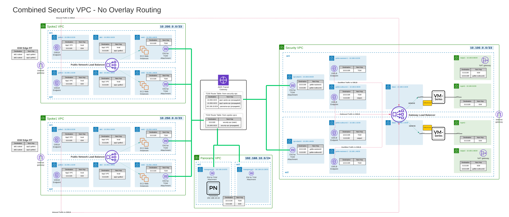
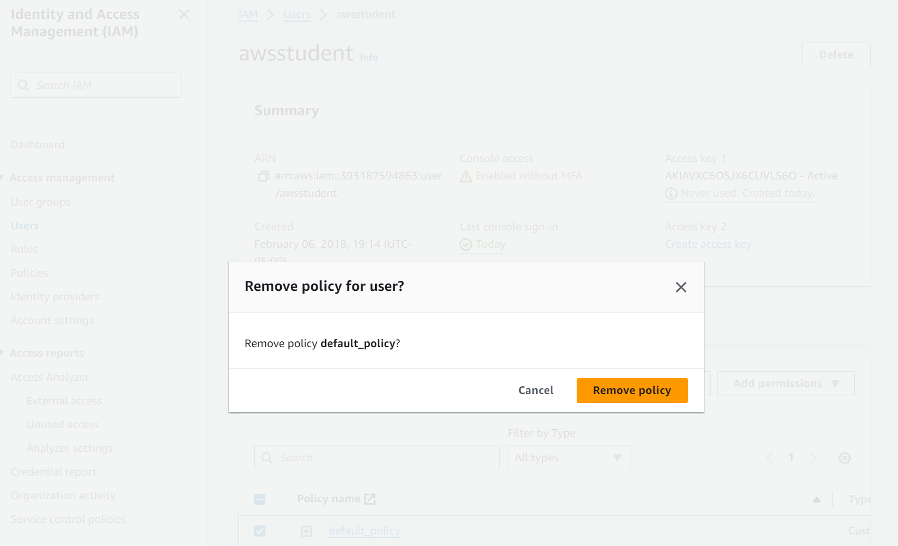
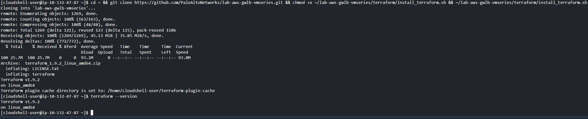
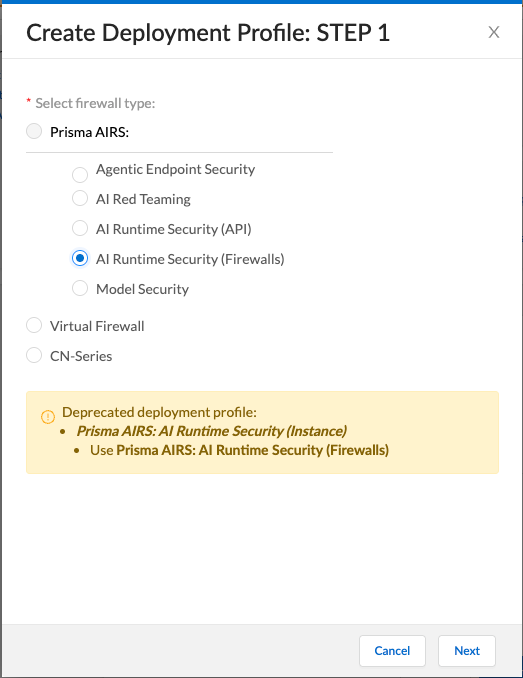
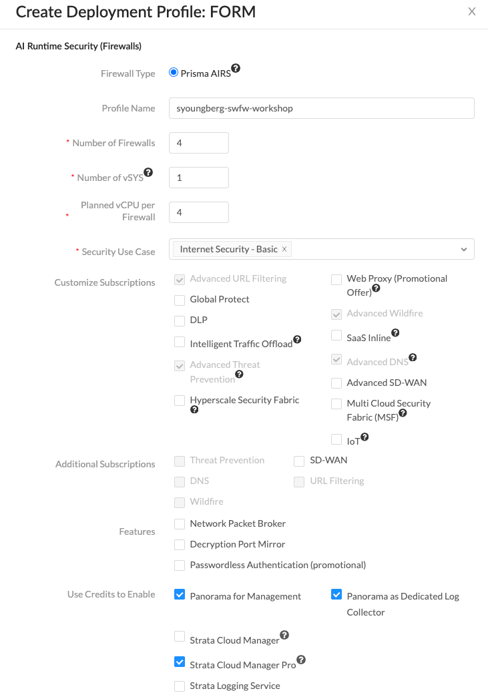
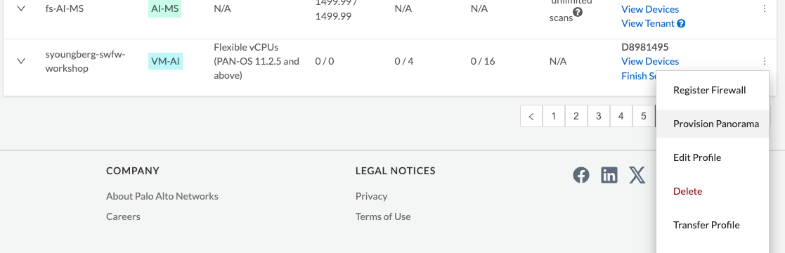
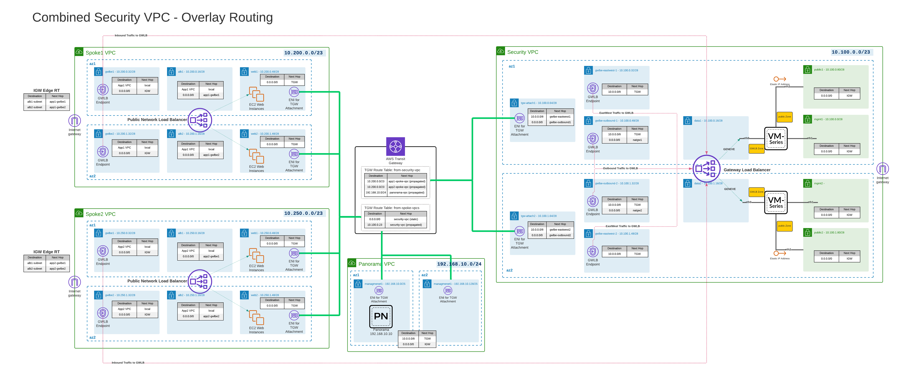

# 1. Warning

----------
This repository and lab guide are intended to be used with a specific QwikLabs scenario, and some steps are specific to Qwiklabs. It contains deployment code and a lab guide for learning GWLB traffic flows with VM-Series. Some configurations and resources are intentionally omitted to be left as troubleshooting exercises. 

***Do not use this for a production deployment or an easy demo environment!***

You can find the regularly maintained terraform modules and example deployments for your production deployments at [pan.dev](https://pan.dev/terraform/docs/swfw/aws/vmseries/overview/). These modules are also published on the [HashiCorp Registry](https://registry.terraform.io/modules/PaloAltoNetworks/swfw-modules/aws/latest).

The [Combined Design](https://pan.dev/terraform/docs/swfw/aws/vmseries/reference-architectures/centralized_design/) example closely matches the design from this learning lab.

----------


# 2. VM-Series on AWS Gateway Load Balancer Lab

```
Manual Last Updated: 2024-07-18
Lab Last Tested: 2024-07-11
```

## 2.1. Overview


This lab will involve deploying Palo Alto Networks VM-Series in AWS with a Gateway Load Balancer (GWLB) topology. You will first deploy a Panorama and then the rest of the AWS resources and VM-Series with bootstrapping. It is a challenge lab that will require you to troubleshoot and fix some issues.


## 2.2. Lab Guide Syntax conventions

- Items with a bullet indicate actions that need to be taken to complete the lab. They are sometimes followed with a code block for copy / paste or reference.
```
Example Code block following an action item
```

> &#8505;  Items with info icon are additional context or details around actions performed in the lab

> &#10067; Items with question mark icon are questions that should be answered on the quiz

Use the corresponding [quiz](https://docs.google.com/forms/d/e/1FAIpQLSfkJdW2cz8kurjB0n7M-WvFOaqfRCuY6OemWf6okQheGO5LMQ/viewform) that relates to the questions you will see inside this guide to test your knowledge!

## 2.3. Table of Contents

- [1. Warning](#1-warning)
- [2. VM-Series on AWS Gateway Load Balancer Lab](#2-vm-series-on-aws-gateway-load-balancer-lab)
  - [2.1. Overview](#21-overview)
  - [2.2. Lab Guide Syntax conventions](#22-lab-guide-syntax-conventions)
  - [2.3. Table of Contents](#23-table-of-contents)
- [3. Lab Topology](#3-lab-topology)
  - [3.1. Flow Diagrams](#31-flow-diagrams)
    - [3.1.1. Outbound Traffic Flows](#311-outbound-traffic-flows)
    - [3.1.2. Inbound Traffic Flows](#312-inbound-traffic-flows)
- [4. Lab Steps](#4-lab-steps)
  - [4.1. Initialize Lab](#41-initialize-lab)
    - [4.1.1. Find SSH Key Pair Name](#411-find-ssh-key-pair-name)
  - [4.2. Update IAM Policies](#42-update-iam-policies)
  - [4.3. Check Marketplace Subscriptions](#43-check-marketplace-subscriptions)
  - [4.4. Launch CloudShell](#44-launch-cloudshell)
  - [4.5. Search Available VM-Series Images (AMIs)](#45-search-available-vm-series-images-amis)
  - [4.6. Clone Repo and Install Terraform](#46-clone-repo-and-install-terraform)
  - [4.7. Deploy Panorama and TGW Infrastructure with Terraform](#47-deploy-panorama-and-tgw-infrastructure-with-terraform)
    - [4.7.1. Provision Panorama Licensing with Software NGFW Credits](#471-provision-panorama-licensing-with-software-ngfw-credits)
  - [4.8. Prepare Panorama](#48-prepare-panorama)
    - [4.8.1. Apply Your New Serial Number (Prepped Image)](#481-apply-your-new-serial-number-prepped-image)
    - [4.8.2. Prepare Panorama for Logging and Bootstrapping](#482-prepare-panorama-for-logging-and-bootstrapping)
  - [4.9. Update Deployment Values in tfvars for VM-series](#49-update-deployment-values-in-tfvars-for-vm-series)
  - [4.10. Apply Terraform](#410-apply-terraform)
  - [4.11. Inspect deployed resources](#411-inspect-deployed-resources)
    - [4.11.1. Get VM-Series instance screenshot](#4111-get-vm-series-instance-screenshot)
    - [4.11.2. Check VM-Series instance details](#4112-check-vm-series-instance-details)
    - [4.11.3. Check cloudwatch bootstrap logs](#4113-check-cloudwatch-bootstrap-logs)
  - [4.12. Verify Bootstrap in Panorama](#412-verify-bootstrap-in-panorama)
  - [4.13. Access VM-Series Management](#413-access-vm-series-management)
  - [4.14. Check bootstrap logs](#414-check-bootstrap-logs)
  - [4.15. Fix GWLB Health Probes](#415-fix-gwlb-health-probes)
  - [4.16. Inbound Traffic Flows to App Spoke VPCs](#416-inbound-traffic-flows-to-app-spoke-vpcs)
    - [4.16.1. Update Spoke1 App VPC networking for Inbound inspection with GWLB](#4161-update-spoke1-app-vpc-networking-for-inbound-inspection-with-gwlb)
    - [4.16.2. Update Spoke2 App VPC networking for Inbound inspection with GWLB](#4162-update-spoke2-app-vpc-networking-for-inbound-inspection-with-gwlb)
    - [4.16.3. Test Inbound Traffic to Spoke Web Apps](#4163-test-inbound-traffic-to-spoke-web-apps)
    - [4.16.4. Test Outbound Traffic from Spoke1 Instance](#4164-test-outbound-traffic-from-spoke1-instance)
    - [4.16.5. Check Inbound Traffic Logs](#4165-check-inbound-traffic-logs)
    - [4.16.6. Check Outbound Traffic Logs](#4166-check-outbound-traffic-logs)
  - [4.17. Outbound and East / West (OBEW) Traffic Flows](#417-outbound-and-east--west-obew-traffic-flows)
    - [4.17.1. Update Spoke1 VPC for OB/EW routing with TGW](#4171-update-spoke1-vpc-for-obew-routing-with-tgw)
    - [4.17.2. Update Spoke2 VPC for OB/EW routing with TGW](#4172-update-spoke2-vpc-for-obew-routing-with-tgw)
    - [4.17.3. Update Transit Gateway (TGW) Route Tables](#4173-update-transit-gateway-tgw-route-tables)
    - [4.17.4. Update Security VPC networking for OB/EW with GWLB](#4174-update-security-vpc-networking-for-obew-with-gwlb)
  - [4.18. Test Traffic Flows](#418-test-traffic-flows)
    - [4.18.1. Test Outbound Traffic from Spoke1 Instances](#4181-test-outbound-traffic-from-spoke1-instances)
    - [4.18.2. Test Inbound Web Traffic to Spoke1 and Spoke2 Apps](#4182-test-inbound-web-traffic-to-spoke1-and-spoke2-apps)
    - [4.18.3. Test E/W Traffic from Spoke1 Instance to Spoke2 Instance](#4183-test-ew-traffic-from-spoke1-instance-to-spoke2-instance)
  - [4.19. GWLBE / Sub-Interface associations](#419-gwlbe--sub-interface-associations)
    - [4.19.1. Configure Zones in Panorama](#4191-configure-zones-in-panorama)
    - [4.19.2. Configure Sub-Interfaces in Panorama](#4192-configure-sub-interfaces-in-panorama)
    - [4.19.3. Create associations from GWLB Endpoints](#4193-create-associations-from-gwlb-endpoints)
    - [4.19.4. Create Zone-Based policies for sub-interfaces](#4194-create-zone-based-policies-for-sub-interfaces)
  - [4.20. Overlay Routing](#420-overlay-routing)
    - [4.20.1. Create Public Interfaces for VM-Series](#4201-create-public-interfaces-for-vm-series)
    - [4.20.2. Associate the EIPs to the Public Interfaces](#4202-associate-the-eips-to-the-public-interfaces)
    - [4.20.3. Configure Networking and Policies in Panorama](#4203-configure-networking-and-policies-in-panorama)
    - [4.20.4. Enable Overlay mode](#4204-enable-overlay-mode)
    - [4.20.5. Test Outbound Traffic](#4205-test-outbound-traffic)
  - [4.21. Review Lab Quiz Questions](#421-review-lab-quiz-questions)
  - [4.22. Finished](#422-finished)

# 3. Lab Topology



## 3.1. Flow Diagrams

Reference these diagrams for a visual of traffic flows through this topology.
### 3.1.1. Outbound Traffic Flows


### 3.1.2. Inbound Traffic Flows


# 4. Lab Steps
## 4.1. Initialize Lab

- Download the `aws-gwlb-lab-secrets.txt` file from the QwikLabs interface for later reference
- Click **Open Console** and authenticate to the AWS account with the credentials displayed in QwikLabs
- Verify your selected region. **The Panorama deployment region is `us-west-2`** - make sure your console is pointed there for the Panorama steps (the VM-Series steps later use `us-east-1`)
- Open the [quiz](https://docs.google.com/forms/d/e/1FAIpQLSfkJdW2cz8kurjB0n7M-WvFOaqfRCuY6OemWf6okQheGO5LMQ/viewform) to answer questions as you go through the guide

<details>
<summary><b>⚙️ Running on a shared / standard AWS account (not QwikLabs)?</b></summary>

Throughout this guide, the default steps assume **QwikLabs + CloudShell**. On a shared/standard account, follow the collapsed "shared / standard account" notes in each step instead:
- Authenticate with your own **SSO/CLI credentials** (there is no QwikLabs console).
- **Bring your own SSH key** (per region) - see 4.1.1.
- Set a unique **`prefix_name_tag`** so your resources don't collide with other students in the same account.
- There is no `aws-gwlb-lab-secrets.txt` - your instructor provides the Panorama/VM-Series credentials and the VM-Series flex-credit auth code.

</details>
  
### 4.1.1. Find SSH Key Pair Name

> &#8505; Any EC2 Instance must be associated with a SSH key pair, the default method of initial interactive login. With successful bootstrapping you should not need to connect to the VM-Series directly, but it is good to keep the key for emergency access. The same key is also used for the test web server instances.

> &#9888; **EC2 key pairs are region-specific.** A key created in one region does not exist in another.

- EC2 Console -> Key pairs
- Copy and record the name of the Key Pair generated by QwikLabs, e.g. `qwikLABS-L17939-10286`
- Download the ssh key from the QwikLabs console (PEM and PPK options available)

> &#8505; On QwikLabs the `qwikLABS*` key exists in both `us-west-2` and `us-east-1`, and the Terraform **auto-detects it** - leave the `*_ssh_key_name` variables as `""`.

<details>
<summary><b>⚙️ Shared / standard account - create your own key pair</b></summary>

Key pairs are per-region, so create one in **each** region you deploy into (Panorama = `us-west-2`, VM-Series = `us-east-1`).

- EC2 Console (set the correct region) -> Key pairs -> **Create key pair**
- Give it a unique name, e.g. `yourname-gwlb-key`, and download the `.pem`/`.ppk`
- Record this name - you will set it in the Terraform `tfvars` (steps 4.7 and 4.9)

</details>


## 4.2. Update IAM Policies

> &#8505; Qwiklabs has an explicit Deny for some actions we need to use for this lab. However, we have permission to remove this policy. Take a look at the other Deny statements while you are here.

<details>
<summary><b>⚙️ Shared / standard account - skip this section</b></summary>

The `awsstudent` user and its `default_policy` Deny are QwikLabs-only. Your SSO role already has the needed permissions - there is no policy to remove, so skip to 4.3.

</details>

> &#8505; It is important to be familiar with IAM concepts for VM-Series deployments. Several features (such as bootstrap, custom metrics, cloudwatch logs, HA, and VM Monitoring) require IAM permissions. You also need to consider IAM permissions in order to deploy with IaC or if using lambda for custom automation.

- Search for `IAM` in the top search bar (IAM is global)
- In IAM dashboard select IAM Users -> `awsstudent`
- Under permissions select the check box for `default_policy` and then click "Remove Policy" to remove it.



---

## 4.3. Check Marketplace Subscriptions

> &#8505; Before you can launch VM-Series or Panorama images in an account, the account must first have accepted the Marketplace License agreement for that product.

> &#8505; The QwikLabs accounts should already be subscribed to these offers, but we will need to verify and correct if required.

> &#8505; This lab deploys the **AI Runtime Security** VM-Series image (Palo Alto Networks, Product ID `prod-v7k5pwjb72ea2`). It is a flex-credit / BYOL-style listing: the AWS Marketplace contract total is **$0.00** and you license the firewalls with Software NGFW (flex) credits via the deployment profile in [4.7.1](#471-provision-panorama-licensing-with-software-ngfw-credits). (The classic `VM-Series Next-Generation Firewall (BYOL)` listing still exists, but this lab uses AI Runtime Security.)

- Search for `AWS Marketplace Subscriptions` in top search bar
- Select Discover Products from left menu -> Filter for Publisher "Palo Alto Networks". Explore the various offerings available
- Select Manage Subscriptions from the left menu
- Verify that there are active subscriptions for both of:
  - `AI Runtime Security` (Palo Alto Networks) - the VM-Series image this lab deploys
  - `Palo Alto Networks Panorama`


- If you have both subscriptions, continue to the next section
- If you are missing either subscription, select `Discover Products` and search for `AI Runtime Security` (or `palo alto`)
- Select `AI Runtime Security` or `Palo Alto Networks Panorama` as needed
- Select `Continue to Subscribe` / `Purchase Options`, review the pricing terms, and click **Accept Terms** to subscribe (the AI Runtime Security contract total is **$0.00**; flex credits cover the license)
- Allow a few moments for the Subscription to be processed
- Repeat for the other Subscription if needed
- Notify lab instructor if you have any issues

> &#10067; Add Question here about the various VM-Series subscription types (BYOL, PAYG, AI Runtime Security)

---

## 4.4. Launch CloudShell

<details>
<summary><b>⚙️ Shared / standard account - run locally instead (optional)</b></summary>

You can skip CloudShell and run everything from your **local machine** (VS Code terminal, macOS or WSL) using your SSO/CLI profile (`export AWS_PROFILE=<your-profile>`). Install Terraform locally per §4.6. Make sure your shell is authenticated and pointed at the correct region for each step (Panorama = `us-west-2`, VM-Series = `us-east-1`).

</details>

- *Verify you are in the assigned region!*
- Search for `cloudshell` in the top search bar
- Close out of the Intro Screen
- Allow a few moments for it to initialize

---

> &#8505; This lab will use Cloudshell for access to AWS CLI and as a runtime environment to provision your lab resources in AWS using Terraform. Cloudshell will have the same IAM role as your authenticated user and has some utilities (git, aws cli, etc) pre-installed. It is only available in limited regions currently.
>
> Anything saved in the home directory `/home/cloudshell-user` will remain persistent if you close and relaunch CloudShell

---

## 4.5. Search Available VM-Series Images (AMIs)

> &#8505; We will use us-west-2 for example of using this search and answering the questions, but your actual deployment for this lab may be in a different region.

- In the cloud console, enter (this filters on the **AI Runtime Security** product code; the VM-Series deploy region for this lab is `us-east-1`):

```
aws ec2 describe-images --filters "Name=owner-alias,Values=aws-marketplace" Name=product-code,Values=b261y39exndwe1ltro1tqpeog --region us-east-1
```

- Press space a few times to page down

- Try using the following query to control what data is returned

```
aws ec2 describe-images --filters "Name=owner-alias,Values=aws-marketplace" Name=product-code,Values=b261y39exndwe1ltro1tqpeog --region us-east-1 --query 'reverse(sort_by(Images,&CreationDate))[].[ImageId,Name]' --output text
```

- This returns the available AI Runtime Security images. The lab selects the **latest** one automatically (currently `AI-Runtime-Security-AWS-12.1.4-h5-prod-v7k5pwjb72ea2`). Note the AMI name varies between the legacy `PA-VM-AWS-<version>-prod-...` and the newer `PA-AI-Runtime-Security-AWS-<version>-prod-...` forms.


> &#10067; What is the BYOL Marketplace AMI ID for 10.1.8 in the us-east-1 region?

> &#10067; What are some options if there is no AMI available for your targeted version?

---

> &#8505;  This terraform deployment will look up the AMI ID to use for the deployment based on the variable `fw_version`. New AMIs are not always published for each minor release. Therefore, it is a good idea to verify what version AMI most closely matches your target version.

> &#8505; product-code is a global value that correlates with Palo Alto Networks marketplace offerings. It is the same across all regions. The Terraform selects the AMI from `fw_license_type` using this map (`terraform/modules/vmseries/variables.tf`):
>
>```
>   "byol"  = "6njl1pau431dv1qxipg63mvah"   # VM-Series Next-Generation Firewall (BYOL)
>   "payg1" = "6kxdw3bbmdeda3o6i1ggqt4km"   # PAYG, Advanced Threat Prevention
>   "payg2" = "806j2of0qy5osgjjixq9gqc6g"   # PAYG, Advanced Security subscriptions
>   "airs"  = "b261y39exndwe1ltro1tqpeog"   # AI Runtime Security (prod-v7k5pwjb72ea2)  <-- this lab
>```
> This lab sets `fw_license_type = "airs"` (in `security-vpc-east1.auto.tfvars`), so it deploys the **AI Runtime Security** image and licenses it with flex credits via the deployment profile in 4.7.1. You will need [Software NGFW Flex Credits](https://www.paloaltonetworks.com/resources/tools/ngfw-credits-estimator) to license the firewalls after deployment.
>
> `byol` is the classic VM-Series image (also flex-licensed). The `payg*` images come pre-licensed and are billed hourly by AWS, which is good for short-lived or autoscaling capacity but generally costlier over time.

> &#8505; For `airs`, the Terraform filters by `product-code` only and uses `most_recent` to select the **latest** AI Runtime Security image automatically (the AMI name varies between `PA-VM-AWS-*` and `PA-AI-Runtime-Security-AWS-*`, so `fw_version` is not used for AIRS). For `byol`/`payg`, the lookup still pins the version via the `PA-VM-AWS-${fw_version}*` name filter.

> &#8505; Not needed for this lab, but when deploying VM-Series from EC2 console, it will default to the latest version. You can instead go to the AWS Marketplace to subscribe to the offering and select previous versions to deploy the desired AMI
> 
> 

---


## 4.6. Clone Repo and Install Terraform

- Run the below command from the CloudShell terminal. It will:
  - Clone the repository that contains the code and resources for this lab
  - Execute a shell script to install Terraform in the CloudShell environment

On CloudShell in AWS:

```
cd ~ && git clone https://github.com/PaloAltoNetworks/lab-aws-gwlb-vmseries.git && chmod +x ~/lab-aws-gwlb-vmseries/terraform/install_terraform.sh && ~/lab-aws-gwlb-vmseries/terraform/install_terraform.sh && source ~/.bashrc
```

Or on local machine, follow instructions from HashiCorp:

https://developer.hashicorp.com/terraform/install

- Verify Terraform is installed
```
terraform version
```



> &#8505; Terraform projects often have version constraints in the code to protect against potentially breaking syntax changes when new version is released. For this project, the [version constraint](https://github.com/PaloAltoNetworks/lab-aws-gwlb-vmseries/blob/main/terraform/vmseries/versions.tf) is:
> ```
> terraform {
>  required_version = ">=0.12.29, <2.0"
>}
>```
>
>Terraform is distributed as a single binary so isn't usually managed by OS package managers. It simply needs to be downloaded and put into a system `$PATH` location. For Cloudshell, we are using the `/home/cloud-shell-user/bin/` so it will be persistent if the sessions times out.


## 4.7. Deploy Panorama and TGW Infrastructure with Terraform

> &#8505; One of the complications with fully automating VM-Series deployments is the need to have a Panorama already running and configured for the VM-Series to bootstrap to. There isn't a built in bootstrap method for Panorama itself. There are ways to orchestrate it, but it is complex. In addition the Panorama takes a long time to initialize. So typically you need to bring up the Panorama as a separate terraform deployment before launching the VM-Series.

- Make sure you are in the appropriate deployment directory

```
cd ~/lab-aws-gwlb-vmseries/terraform/panorama
```

> &#8505; On QwikLabs no edits are needed here - leave `panorama_ssh_key_name = ""` (it auto-detects the `qwikLABS*` key) and `prefix_name_tag = ""`. Just `init` and `apply`.

<details>
<summary><b>⚙️ Shared / standard account - edit <code>terraform.tfvars</code> first</b></summary>

Open `terraform/panorama/terraform.tfvars` and set:
- `panorama_ssh_key_name` = the key pair name you created in 4.1.1 (must exist in `us-west-2`).
- `prefix_name_tag` = a short unique prefix, e.g. your initials + `-` (such as `"ad-"`), so your VPC, TGW, IAM role, etc. don't collide with other students in the shared account.

The AMI (`panorama_ami_id`) and region are already set - no change needed.

</details>

- Initialize Terraform

```
terraform init
```

- Apply Terraform

```
terraform apply
```

- When Prompted for confirmation, type `yes`

- It should take a few minutes for Terraform to finish deploying all resources

- When complete, you will see an output containing the Panorama URL. **Copy these locally so you can reference them in later steps**

> &#8505; You can also come back to this directory in CloudShell later and run `terraform output` to view this information 

- It will be about 7 minutes from the time the Terraform finishes before you can access and authenticate to the Panorama.

> &#10067; What AWS resources were created from this terraform execution?

### 4.7.1. Provision Panorama Licensing with Software NGFW Credits

> &#8505; The lab Panorama image is partially prepped and **already licensed**, so this step is **not strictly required** if you deployed the prepped image. It **is** required if you bring up Panorama from the public Marketplace image. Either way, walk through it once - provisioning a license from a **Software NGFW Credits** deployment profile is the real-world workflow and is worth seeing end to end.

[Software NGFW Credits](https://docs.paloaltonetworks.com/vm-series/11-1/vm-series-deployment-guide/license-the-vm-series-firewall/software-ngfw-credits) are a flexible, pooled licensing model ("flex credits"): instead of perpetual per-VM licenses, you allocate credits from a pool to a **deployment profile** that describes how many firewalls/vCPUs you need and which subscriptions to enable. The same profile can also license **Panorama** - for management and/or as a dedicated log collector. Provisioning generates a Software NGFW **auth code** (starts with `D`) that the firewall or Panorama uses to license itself.

> &#10067; Why is a credit-based ("flex") model well suited to autoscaling VM-Series deployments compared to perpetual licenses?

#### Create a Deployment Profile

1. Log in to the [Customer Support Portal (CSP)](https://support.paloaltonetworks.com).
2. Go to **Products > Software NGFW Credits**, then click **Create Deployment Profile**.
3. **Step 1 - Select the firewall type.** Choose the option that matches your credit pool - **Virtual Firewall** for a classic VM-Series pool, or **Prisma AIRS > AI Runtime Security (Firewalls)** if your pool is AIRS-based - then click **Next**.



4. **Complete the profile form:**
   - **Profile Name** - something identifiable, e.g. `<your-initials>-swfw-workshop`
   - **Number of Firewalls** - `4` (the two VM-Series in this lab, plus headroom)
   - **Planned vCPUs per Firewall** - `4`
   - **Security Use Case** - e.g. `Internet Security - Basic` (adjust the subscriptions as you like)
   - Under **Use Credits to Enable**, check **Panorama for Management** and **Panorama as Dedicated Log Collector** - this lab uses Panorama for both management and logging.



5. Click **Calculate Estimated Cost** to see the credits/hour, then **Create Deployment Profile**. The new profile is issued a Software NGFW **auth code** (starts with `D`) - this is the auth code used to bootstrap/license the firewalls.

#### Provision the Panorama License

1. Back on the **Software NGFW Credits** page, open the **⋮ (More Options)** menu on your deployment profile row and select **Provision Panorama**.



2. Choose **Provision New** to generate a fresh Panorama serial number + auth code (or **Migrate Existing** to convert an existing virtual Panorama license without changing its serial). Select the entry and click **Provision**.

#### Activate on Panorama

1. In the Panorama web UI, go to **Panorama > Setup > Management** and confirm the **Serial Number** matches the one you just provisioned (set it here if you deployed the Marketplace image).
2. Go to **Panorama > Licenses** and click **Retrieve license keys from license server**. Panorama checks in with the licensing cloud and activates its **Device Management** and **Support** licenses from your credit pool.

> &#8505; Reference: [Create a Deployment Profile](https://docs.paloaltonetworks.com/vm-series/11-1/vm-series-deployment-guide/license-the-vm-series-firewall/software-ngfw-credits/create-a-deployment-profile) · [Software NGFW Credits overview](https://docs.paloaltonetworks.com/vm-series/11-1/vm-series-deployment-guide/license-the-vm-series-firewall/software-ngfw-credits) · [Customer Support Portal](https://support.paloaltonetworks.com)

## 4.8. Prepare Panorama

> &#8505; The Panorama was deployed from a partially prepped image that is licensed and has a baseline Template/Device Group. However, additional steps will be completed here to prepare the Panorama for logging and bootstrapping.

- Copy the `panorama_url` from the Terraform output and access it in a browser.
  
- Authenticate using the credentials from `aws-gwlb-lab-secrets.txt` *(shared / standard account: use the Panorama admin credentials provided by your instructor - the pre-baked lab image ships with set credentials)*

### 4.8.1. Apply Your New Serial Number (Prepped Image)

> &#9888; **Do this if you provisioned a new Panorama serial/license in [4.7.1](#471-provision-panorama-licensing-with-software-ngfw-credits).** Panorama and the managed firewalls cannot obtain device certificates until the serial number is set, so this is required for licensing and for the VM-Series to connect. The pre-baked image ships with an existing serial and a log collector bound to it, and you cannot change the serial while that collector config is in place. Order matters: clear the collector (including a reboot) **before** you set the new serial.

1. **Remove the log collector config.** Panorama > Collector Groups, delete the existing collector group. Then Panorama > Managed Collectors, delete the existing managed collector. **Commit to Panorama.**
2. **Reboot Panorama to clear the collector.** Panorama > Setup > Operations > **Reboot Panorama**. Wait for it to come back up before continuing.
3. **Set the new serial number.** Panorama > Setup > Management, set the **Serial Number** to the one you provisioned in 4.7.1. (No reboot is needed after setting it.)
4. **Upgrade Panorama to the latest 12.1.x.** Panorama > Software, Check Now, download, and install the latest **12.1.x** release (this reboots Panorama).
5. **Rebuild the log collector.** Re-add the managed collector (paste the new S/N, add **Disk A**), then re-create the collector group **named `default`** (the name matters) with this Panorama as a member. Do a **targeted push** to the `default` collector group and confirm it shows **In sync** (Panorama > Managed Collectors).

> &#8505; The collector group must be named **`default`** because the VM-Series bootstrap intentionally does **not** set `cgname`, so the firewalls fall back to the `default` collector group. (Setting a collector-group name in bootstrap has historically been buggy with the licensing plugin, so we omit it.)

> &#8505; Steps 1 and 5 overlap with the detailed collector setup in 4.8.2 below; the difference here is doing it around the serial-number change, reboot, and upgrade. (Basics for now; we will flesh this out after testing.)

### 4.8.2. Prepare Panorama for Logging and Bootstrapping

- Navigate to Panorama > Setup > Interfaces, and click on the Management Interface
  - Add the Public IP address of Panorama to the "Public IP Address" field

- Navigate to Panorama > Collector Groups and delete the existing collector group

- Navigate to Panorama > Managed Collectors and delete the existing log-collector, then commit to Panorama

- From the dashboard, copy the serial number of Panorama (Found under the general information)

- Configure a new log collector by navigating to Panorama > Managed Collectors > Add
  - Paste the serial number to the collector S/N, then click Ok
  - Commit to Panorama

- Click on the newly configured log collector (Will have the S/N as its name), then navigate to the Disks Tab
  - Click Add, then add “Disk A”, then click Ok
  - Commit to Panorama

- Navigate to Panorama > Collector Groups, then click Add
  - Use “default” for the name of the Collector Group, then select the “GWLB-LAB-PANORAMA-01” under the Collector Group Members, then click Ok
  - Commit to Panorama
  - Navigate to Commit > Push to Devices > Edit Selections > Collector Groups and select the “default” collector group. Then click Ok
  - Push to the collector group specified above
  - Check the Managed Collectors page under Panorama > Managed Collectors. The collector group status should be “In sync”

- Navigate to Panorama > Plugins > Check Now
  - Search for `sw_fw_license-1.1.2`. Then download and install the plugin

- Navigate to Panorama > SW Fireall License

- Configure a SW Firewall License Bootstrap Definition
  - Name: `aws-gwlb-lab`
  - Auth Code: Found in `aws-gwlb-lab-secrets.txt` *(shared / standard account: the VM-Series **flex-credit auth code** from your CSP deployment profile - see 4.7.1)*

- Configure a SW Firewall License Manager
  - Name: `aws-gwlb-lab`
  - Device Group: `AWS-GWLB-LAB`
  - Template Stack: `stack-aws-gwlb-lab`
  - Auto Deactivate: `Never`
  - Bootstrap Definition: `aws-gwlb-lab`

> &#8505; Auto Deactive is handy for automating the cleanup of devices that have been terminated, for example in an autoscaling VM-Series deployment. Caution should be used as there is a possibility for false positives. For example, if there is an unrelated connectivity issue, Panorama could perceive that the devices are no longer active and initiate the deactivation based on the timer. This plugin can also be used for manually deactivating devices, or creating an event-driven workflow to make an API call to Panorama for deactivation. For any deactivation functions to work, the Panorama must be configured with a [Licensing API Key ](https://docs.paloaltonetworks.com/vm-series/10-1/vm-series-deployment/license-the-vm-series-firewall/install-a-license-deactivation-api-key)that is generated from the Customer Support Portal. 

- Configure Template Stack to Automatically Push Content
  - Panorama -> Templates -> `stack-aws-gwlb-lab`
  - Check Box for `Automatically push content....`

> &#8505; This feature was added in 10.2 and is very useful for automated deployments, especially autoscaling. It ensures that as devices bootstrap, the Panorama will push down the current dynamic content before committing the configuration.

- Commit to Panorama and verify it completes successfully.

- Return to Panorama -> SW Firewall Licenses -> License Manager
  
- Select `Show Bootstrap Parameters`

- Copy the bootstrap parameters for use in the next step

## 4.9. Update Deployment Values in tfvars for VM-series


Most of the bootstrap parameters and environment-specific variable values have already been prepped in the Terraform code for this deployment. On QwikLabs you only need to update the `auth-key` value for your Panorama. *(Shared / standard account: you also set your SSH key and prefix - see the collapsed note below.)*

- **When bootstrapping, be very careful to ensure all of the parameters are set correctly. These values will be passed in as User Data for the VM-Series launch. If values are incorrect, the bootstrap will likely fail and you will need to redeploy!**

- Make sure you are in the appropriate directory

```
cd ~/lab-aws-gwlb-vmseries/terraform/vmseries
```

<details>
<summary><b>⚙️ Shared / standard account - edit <code>security-vpc-east1.auto.tfvars</code> first</b></summary>

Open `security-vpc-east1.auto.tfvars` and set:
- `vmseries_ssh_key_name` = your key pair name. **It must exist in `us-east-1`** (the VM-Series region) - key pairs are per-region, so create one in us-east-1 even if you already made one in us-west-2 for Panorama.
- `prefix_name_tag` = **the same prefix you used for the Panorama deploy** (e.g. `"ad-"`). This is how the VM-Series stack finds *your* Panorama - it looks up the peer transit gateway by `<prefix>tgw-us-west-2`. If this doesn't match your Panorama's prefix, the apply will fail to find the peer TGW.

The region, AMI, and `panorama_host` are already set - no change needed.

</details>

- Edit the file `student.auto.tfvars` to update the value of the `auth-key` variable.

> &#8505; The `auth-key` is the **VM-Series bootstrap parameter generated by *your* Panorama** in step 4.8 (Panorama → SW Firewall Licenses → License Manager → **Show Bootstrap Parameters**). On QwikLabs it is also pre-generated in `aws-gwlb-lab-secrets.txt` - either source works.

> &#9888; **Copy ONLY the `auth-key`.** The "Show Bootstrap Parameters" screen also lists a `panorama-server` IP, but the licensing plugin can display a **stale/old IP** there. **Do not** change `panorama_host` - it is already set to `192.168.10.10` (your deployed Panorama's private address, reached over the TGW). This lab uses a single Panorama (no HA), so do not set `panorama-server-2`.

- Set the value inside of the empty quotes

```
auth-key        = "_AQ__xxxxxxxxxxxxxxxxxxx"
```


<details>
  <summary style="color:red">Expand Me For Specific Steps</summary>

---
- ( Option 1 ) Use vi to update values in `student.auto.tfvars`

```
vi student.auto.tfvars
```
---
- ( Option 2 ) If you don't like vi, you can install nano editor:
```
sudo yum install -y nano
nano student.auto.tfvars
```
---

</details>


- Verify the contents of file have the correct value

```
cat ~/lab-aws-gwlb-vmseries/terraform/vmseries/student.auto.tfvars
```

> &#8505; This deployment is using a [basic bootstrapping](https://docs.paloaltonetworks.com/plugins/vm-series-and-panorama-plugins-release-notes/vm-series-plugin/vm-series-plugin-20/vm-series-plugin-201/whats-new-in-vm-series-plugin-201.html) that does not require S3 buckets. Any parameters normally specified in init-cfg can now be passed directly to the instance via UserData. Prerequisite is the image you are deploying has plugin 2.0.1+ installed

> &#10067; What are some bootstrap options that won't be possible with this basic bootstrap method?

> &#8505; If you have time left after the rest of the lab activities, later steps will return to do some more digging into the terraform code.

## 4.10. Apply Terraform

- Make sure you are in the appropriate directory

```
cd ~/lab-aws-gwlb-vmseries/terraform/vmseries
```
- Initialize Terraform

```
terraform init
```

- Apply Terraform

```
terraform apply
```

- When Prompted for confirmation, type `yes`


- It should take 5-10 minutes for Terraform to finish deploying all resources

- When complete, you will see a list of outputs. **Copy these locally so you can reference them in later steps**

- If you do get an error, first try to run `terraform apply` again to finish the update of any pending resources. Notify the lab instructor if there are still issues.

> &#8505; You can also come back to this directory in CloudShell later and run `terraform output` to view this information 


## 4.11. Inspect deployed resources

All resources are now created in AWS, but it will be around 10 minutes until VM-Series are fully initialized and bootstrapped.

In the meantime, let's go look at what you built!


- EC2 Dashboard -> Instances -> Select `vmseries01` -> Actions -> Instance settings -> Edit user data

- Verify the values match what was provided in your Lab Details

> &#10067; What are some tradeoffs of using the user-data method for bootstrap vs S3 bucket?

> &#10067; What needs to happen if you have a typo or missed a value for bootstrap when you deployed?

---
### 4.11.1. Get VM-Series instance screenshot

- EC2 Dashboard -> Instances -> Select `vmseries01` -> Actions -> Monitor and troubleshoot -> Get instance screenshot

> &#8505; This can be useful to get a view of the console during launch. It is not interactive and must be manually refreshed, but you can at least see some output related to the bootstrap process or to troubleshoot if the VM-Series isn't booting properly or is in maintenance mode.

---

### 4.11.2. Check VM-Series instance details

- EC2 Dashboard -> Instances -> Select `vmseries01` -> Review info / tabs in bottom pane


> &#10067; What is the instance type? 

> &#10067; How many interfaces are associated to the VM-Series? 

> &#10067; Which interface is the default ENI for the instance? 

> &#10067; Which interface has a public IP associated?

> &#10067; Check the security group associated with the "data" interface. What is allowed inbound? What is the logic of this SG?

> &#10067; Review the Instance Profile (IAM Role) the VM-Series launched with. What actions does it allow? 

> &#10067; What are some other use-cases where you need to allow additional IAM permissions for the VM-Series instance profile?

---

### 4.11.3. Check cloudwatch bootstrap logs

- Search for `cloudwatch` in the top search bar
- Logs -> Log groups -> PaloAltoNetworksFirewalls
- Assuming enough time has passed since launch, verify that the bootstrap operations have completed successfully.

> &#8505; It is normal for the VMs to briefly lose connectivity to Panorama after first joining.

> &#8505; This feature is only implemented for AWS currently.

> &#10067; What is required to enable these logs during the boot process?

---


## 4.12. Verify Bootstrap in Panorama

> &#8505; For this lab, the Panorama and VM-Series mgmt are publicly accessible. For production deployments, management should not be exposed to inbound Internet traffic as a general practice. If public inbound management access is required, make sure to use other controls (MFA, AWS security groups, PAN-OS permitted-ip lists).

- Login to Panorama web interface with student credentials
- Check Panorama -> Managed Devices -> Summary
- Verify your deployed VM-Series are connected and successfully bootstrapped
- Verify that the auto-commit push succeeded for Shared Policy and Template and that devices are "In sync"
- Check Panorama system logs to verify the content push and licensing was successful
  - Monitor -> Device Group Dropdown = All -> System
  - Search for the serial number of one of your VM-Series
    - `( description contains '00795xxxxxxx' )`
- Inspect Pre-Configured Interface, Zone, and Virtual Router configuration for your template
- Inspect Pre-Configured Security Policies and NAT Policies for your Device Group

> &#10067; Why are NAT policies not needed for GWLB model?


## 4.13. Access VM-Series Management

- Most configurations will be done in Panorama, but we will use the local consoles for some steps and validation

- Refer to the output you copied from your terraform deployment for the public EIPs associated to each VM-Series management interface
  
```
vmseries_eips = {
  "vmseries01-mgmt" = "54.71.121.124"
  "vmseries02-mgmt" = "44.237.145.237"
}
```
- Refer to `aws-gwlb-lab-secrets.txt` for the VM-Series local credentials. These are the same credentials you used for Panorama. *(Shared / standard account: use the VM-Series local credentials provided by your instructor.)*

- Establish a connection to both VM-Series Web UI via HTTPS
- Establish a connection to both VM-Series CLI via SSH
  - You can use Cloud Shell for the SSH session if it is blocked on your local machine

> &#10067; Why don't you have to use an SSH key pair to authenticate to these VM-Series?

## 4.14. Check bootstrap logs

> &#8505; It is common to have issues when initially setting up an environment for bootstrapping. Thus it is good to know how to troubleshoot. When using the new basic bootstrapping with user-data, there is less potential for problems.
>
> Some things to keep in mind:
>- Default AWS ENI needs access to reach S3 bucket as well as path to Internet for licensing
>   - S3 access can be via internet or with a VPC endpoint
>   - IAM Instance Profile will need permissions to access S3 bucket
> - When using interface swap, the subnet for the second ENI will also need a path to S3 and Internet
>   - Interface swap can be done with user-data or in init-cfg parameters. 
>   - Generally better to do via user-data
> - Template Stack and Device Group names must match exactly or they will never join Panorama (no indication of this in Panorama logs)
> - If there are any issues with licensing, VM-Series will not join Panorama (no indication of this in Panorama logs)

- Via SSH session to either VM-Series, check the bootstrap summary
  
```
show system bootstrap status
```

- Check the bootstrap detail log

```
debug logview component bts_details
```

> &#8505; If you have Cloudwatch logs enabled, you can see most of this status without SSH session to VM-Series.


## 4.15. Fix GWLB Health Probes

- Check GWLB Target Group status
  - In EC2 Console -> Target Groups -> select `security-gwlb`
  - In the `Targets` tab, note that the status of both VM-Series is unhealthy
  - Switch to `Health Checks` tab to verify health check settings

> &#10067; What Protocol and Port is the Target Group Health Probe configured to use?

> &#10067; What Protocol and Port is the GWLB listening on and forwarding to the VM-Series instances?

> &#8505; You can check traffic logs either in Panorama or local device

> &#8505; **Reboot your VM-Series if you do not see any traffic logs!**
> 
- Check Traffic Logs for Health Probes
  - In Panorama UI -> Monitor -> Traffic
  - Analyze the traffic logs for the port 80 traffic
  - Enable Columns to view `Bytes Sent` and `Bytes Received`
  - Notice that the sessions matching allow policy for `student-gwlb-any` policy but aging out

> &#10067; Why are there two different source addresses in the traffic logs for these GWLB Health Probes?


- Resolve the issue with the Health Probes

- **To verify your solution (or shortcut!), expand below for specific steps**

<details>
  <summary style="color:red">Expand Me For Specific Steps</summary>

> &#8505; We can see in the traffic logs that the health probes are being received. So we know they are being permitted by the AWS Security Group. They are being permitted by catch-all security policy but there is no return traffic (Notice 0 Bytes Received in the traffic logs). This indicates the VM-Series dataplane interface is not listening 

  - Create and add Interface Management profile to eth1/1
    - In Panorama select Network Tab -> Template `tpl-aws-gwlb-lab`
    - Create an Interface Management Profile
      - Name: `gwlb-health-probe`
      - Services: HTTP
      - Permitted IP addresses: `10.100.0.16/28`, `10.100.1.16/28`
    - Select Interfaces -> ethernet1/1 -> Advanced -> Management Profile `gwlb-health-probe`


  - Create a specific security policy for these health probes to keep logging clean
    - In Panorama select Policies Tab -> Device Group `AWS-GWLB-LAB`
    - Create a new security policy
      - Name: `gwlb-health-probe`
      - Source Zone: `gwlb`
      - Source Addresses: `10.100.0.16/28`, `10.100.1.16/28` (Can use predefined address objects)
      - Dest Zone: `gwlb`
      - Dest Addresses: `10.100.0.16/28`, `10.100.1.16/28` (Can use predefined address objects)
      - Application: `Any`
      - Serivce: `service-http`
    - Make sure the new policy is before the existing catch-all `student-gwlb-any` policy

  - Commit and Push your changes


</details>

- Verify Traffic Logs have Bytes Received and are matching the appropriate security policy
- Return to the AWS console to verify the Targets are now showing as healthy


> &#10067; Why is the application still detected as incomplete?

## 4.16. Inbound Traffic Flows to App Spoke VPCs

<details>
<summary><b>⚙️ Shared / standard account - resource naming for the manual console steps (§4.16–4.20)</b></summary>

Every resource name shown below (VPCs, route tables, subnets, endpoints, e.g. `security-vpc`, `spoke1-vpc-igw-edge`) is created with **your `prefix_name_tag` in front of it** - so `security-vpc` appears as `<yourprefix>security-vpc` (e.g. `ad-security-vpc`). Filter the VPC Dashboard by your prefix to see only your resources, and match on the suffix shown in this guide. *(On QwikLabs the prefix is empty, so names match the guide exactly.)*

</details>

- The deployed topology does not have all of the AWS routing in place for a working GWLB topology and you must fix it!
- Refer to the diagram and try to resolve before looking at the specific steps.

> &#8505; For the GWLB Distributed model, Inbound traffic for public services comes directly into the App Spoke Internet Gateway. The Ingress VPC route table directs traffic to the GWLB Endpoints in the App Spoke VPC.
> 
> Application owners can provision their external facing resources in their VPC (EIP, Public NLB / ALB, etc), but all traffic will be forwarded to Security VPC (via GWLB endpoint) for inspection prior to reaching the resource.
> 
> This inbound traffic flow uses AWS Private Link technology and does not involve the Transit Gateway at all.

- Tip: In the VPC Dashboard you can set a filter by VPC, which will apply to any other sections of the dashboard (subnets, route tables, etc)

 


### 4.16.1. Update Spoke1 App VPC networking for Inbound inspection with GWLB

- First, investigate `spoke1-app-vpc` Route Tables in the VPC Dashboard and try to identify and fix what is missing. Refer to the diagram for guidance.
- For **inbound** traffic, no changes are required for the `web` route tables in the Spoke VPCs
- Refer to terraform output for GWLB Endpoint IDs (or identify them in VPC Dashboard)

- **To verify your solution (or shortcut!), expand below for specific steps**

<details>
  <summary style="color:red">Expand For Specific Steps</summary>

Starting left to right on the diagram...

  - VPC Dashboard -> Filter by VPC -> `spoke1-app-vpc`
  - Route Tables -> `spoke1-vpc-igw-edge` -> Routes Tab (bottom panel)
  - Add Route (spoke1-vpc-alb1 subnet CIDR to spoke1-gwlbe1)
     - CIDR: 10.200.0.16/28
     - Target: Gateway Load Balancer Endpoint (ID of spoke1-vpc-inbound-gwlb-endpoint1 GWLBE)
  - Add Route (spoke1-vpc-alb2 subnet CIDR to spoke2-gwlbe2)
     - CIDR: 10.200.1.16/28
     - Target: Gateway Load Balancer Endpoint (ID of spoke1-vpc-inbound-gwlb-endpoint2 GWLBE)
  - Save Routes

---  
  - Route Tables -> `spoke1-vpc-gwlbe1` -> Routes Tab (bottom panel)
  - Add Route (default route to spoke1-IGW)
     - CIDR: 0.0.0.0/0
     - Target: Internet Gateway (only one per VPC)
  - Save Routes

---  
  - Route Tables -> `spoke1-vpc-gwlbe2` -> Routes Tab (bottom panel)
  - Add Route (default route to spoke1-IGW)
     - CIDR: 0.0.0.0/0
     - Target: Internet Gateway (only one per VPC)
  - Save Routes
  
---
  - Route Tables -> `spoke1-vpc-alb1` -> Routes Tab (bottom panel)
  - Add Route (default route to spoke1-gwlbe1)
     - CIDR: 0.0.0.0/0
     - Target: Gateway Load Balancer Endpoint (ID of spoke1-vpc-inbound-gwlb-endpoint1 GWLBE)
  - Save Routes

---  

  - Route Tables -> `spoke1-vpc-alb2` -> Routes Tab (bottom panel)
  - Add Route (default route to spoke1-gwlbe2)
     - CIDR: 0.0.0.0/0
     - Target: Gateway Load Balancer Endpoint (ID of spoke1-vpc-inbound-gwlb-endpoint2 GWLBE)
  - Save Routes

---  

</details>

### 4.16.2. Update Spoke2 App VPC networking for Inbound inspection with GWLB

- First investigate **`spoke2-app-vpc`** Route Tables in the VPC Dashboard and try to identify and fix what is missing. Refer to the diagram for guidance.
- For **inbound** traffic, no changes are needed for the `web` route tables in the App Spoke VPCs
- Refer to terraform output for GWLB Endpoint IDs (or identify them in VPC Dashboard)

- **To verify your solution (or shortcut!), expand below for specific steps**

<details>
  <summary style="color:red">Expand For Specific Steps</summary>

Only `spoke2-vpc-igw-edge` Route Table is missing routes for App2 Spoke

Starting left to right on the diagram...

  - VPC Dashboard -> Filter by VPC -> `spoke2-app-vpc`
  - Route Tables -> `spoke2-vpc-igw-edge` -> Routes Tab (bottom panel)
  - Add Route (spoke2-vpc-alb1 subnet CIDR to spoke2-gwlbe1)
     - CIDR: 10.250.0.16/28
     - Target: Gateway Load Balancer Endpoint (ID of spoke2-vpc-inbound-gwlb-endpoint1 GWLBE)
  - Add Route (spoke2-vpc-alb2 subnet CIDR to spoke2-gwlbe2)
     - CIDR: 10.250.1.16/28
     - Target: Gateway Load Balancer Endpoint (ID of spoke2-vpc-inbound-gwlb-endpoint2 GWLBE)
  - Save Routes


</details>

###  4.16.3. Test Inbound Traffic to Spoke Web Apps

Generate some HTTP traffic to the web apps using the DNS name of the Public NLB that is in front of the web compute instances. URL will be the FQDN of the NLBs from the terraform output

- Reference terraform output for `app_nlbs_dns`
- From your local machine browser, attempt connection to http://`spoke1-nlb`
- From your local machine browser, attempt connection to http://`spoke2-nlb`
- Refresh a few times

> &#8505; The inbound routing should now be in place, but you will not get a response yet as the instances are not yet running a web server.

> &#8505; The web instances are configured to update and install the web server automatically with a user-data script, but they first must have a working outbound path to the Internet to retrieve packages.

###  4.16.4. Test Outbound Traffic from Spoke1 Instance

Access the spoke web servers console using the AWS Systems Manager connect

- Navigate to Instances view in the EC2 Console
- Select `spoke1-web-az1` and click Connect button in the top right
- Switch to Session Manager and Connect
- From the Shell, try to generate outbound traffic

```ping 8.8.8.8```

```curl http://ifconfig.me```

> &#8505; Session Manager relies on a package being installed in the OS that makes an outbound connection to the AWS SSM service. We do not have outbound internet currently, but there is a private endpoint for the SSM service configured. It is not possible to use SSM for CLI access to VM-Series, as it does not have the package installed


###  4.16.5. Check Inbound Traffic Logs

- Panorama -> Monitor Tab -> Traffic
- Filter for traffic *to* Spoke 1 `( addr.dst in 10.200.0.0/16 )`
- Notice that there are already many connection attempts from Internet scans to the App1 Public NLB and being permitted by VM-Series!
- Notice that VM-Series is able to see the original client source IP for connections to App Spokes
- Try to identify your client source IP in the logs

> &#10067; Why does VM-Series see the private NLB addresses as the destination instead of the public address?

###  4.16.6. Check Outbound Traffic Logs

> &#8505; Since outbound traffic was not working earlier, let's check to see if it is making it to VM-Series.

- Panorama -> Monitor Tab -> Traffic
- Filter for traffic *from* Spoke 1 `( addr.src in 10.200.0.0/16 )`
- Notice that there is no outbound traffic from the Spokes yet, so we are likely missing something in routing between App Spoke -> TGW -> GWLB.

> &#8505; We now have visibility and control for inbound connectivity but instances do not yet have a path outbound.


## 4.17. Outbound and East / West (OBEW) Traffic Flows

- The deployed topology does not have all of the AWS routing in place for a working GWLB topology and you must fix it!
- Refer to the diagram and try to resolve before looking at the specific steps
- We will work from left to right on the diagram

### 4.17.1. Update Spoke1 VPC for OB/EW routing with TGW

- First, investigate `spoke1-app-vpc` Route Tables in the VPC Dashboard and try to identify and fix what is missing. Refer to the diagram for guidance.

- **To verify your solution (or shortcut!), expand below for specific steps**

<details>
  <summary style="color:red">Expand For Specific Steps</summary>

  - VPC Dashboard -> Filter by VPC -> `spoke1-app-vpc`
  - Route Tables -> `spoke1-vpc-web1` -> Routes Tab (bottom panel)
  - Add Route (default route to TGW)
     - CIDR: 0.0.0.0/0
     - Target: Transit Gateway (only one available)
     - Save Routes

---

  - Route Tables -> `spoke1-vpc-web2` -> Routes Tab (bottom panel)
  - Add Route (default route to TGW)
     - CIDR: 0.0.0.0/0
     - Target: Transit Gateway (only one available)
     - Save Routes
  
</details>

### 4.17.2. Update Spoke2 VPC for OB/EW routing with TGW

- First, investigate `spoke2-app-vpc` Route Tables in the VPC Dashboard and try to identify and fix what is missing. Refer to the diagram for guidance.

- **To verify your solution (or shortcut!), expand below for specific steps**

<details>
  <summary style="color:red">Expand For Specific Steps</summary>

- Nothing is missing for `spoke2-app-vpc`! Web1 and Web2 Route Tables already have routes to TGW.

</details>


### 4.17.3. Update Transit Gateway (TGW) Route Tables


> &#8505; For GWLB Centralized Outbound, the TGW routing for Outbound and EastWest (OB/EW) traffic is the same as previous TGW models. Spokes send all traffic to TGW. Spoke TGW RT directs all traffic to Security VPC. Security TGW RT has routes to reach all spoke VPCs for return traffic.
>
>For OB/EW flows, the GWLB doesn't come into play until traffic comes into the Security VPC from TGW before being forwarded to a GWLB endpoint.

- First, investigate Transit Gateway Route Tables in the VPC Dashboard and try to identify and fix what is missing. Refer to the diagram for guidance.

- **To verify your solution (or shortcut!), expand below for specific steps**

<details>
  <summary style="color:red">Expand For Specific Steps</summary>

  - VPC Dashboard -> Transit Gateway Route Tables -> Select `from-spoke-vpcs`
  -  Check `Associations` tab and verify the two spoke App VPCs are associated
  -  Check Routes tab and notice there is no default route
  -  Create Static Route (Default to security VPC)
     - CIDR: 0.0.0.0/0
     - Attachment: Security VPC (Name Tag = security-vpc)

- VPC Dashboard -> Transit Gateway Route Tables -> Select `from-security-vpc`
  -  Check `Associations` tab and verify the security VPC is associated
  -  Check `Routes` tab and notice there are no existing routes to reach the spoke VPCs
  -  Select Propagations Tab -> Create Propagation
  -  Select attachment with Name Tag `spoke1-vpc`
  -  Repeat for attachment with Name Tag `spoke2-vpc`
  -  Return to `Routes` tab and verify the table now has routes to reach the App VPCs (may need to refresh)


</details>

> &#10067; What needs to be done on the TGW route tables in order to bring additional Spoke VPCs online for OB/EW traffic?


### 4.17.4. Update Security VPC networking for OB/EW with GWLB

> &#8505; The routing and traffic flows can be tricky to grasp, especially when designing for multiple availability zones. For this lab, we are using separate endpoints for Outbound VS EastWest, plus separate endpoints per AZ. Take your time and understand the traffic flows as you configure the routing.
>
> Multi-AZ GWLB generally requires unique route tables per subnet in both AZs in order to direct traffic in that AZ toward the resources (GWLB endpoint, NAT GW) in the same AZ.

- First, investigate the VPC Route Tables in the Security VPC and try to identify and fix what is missing. Refer to the diagram for guidance.
- Refer to your output from Terraform for the GWLB Endpoint IDs
- You can also view the deployed endpoints VPC Dashboard -> Endpoints

- **To verify your solution (or shortcut!), expand below for specific steps**

<details>
  <summary style="color:red">Expand For Specific Steps</summary>

  - VPC Dashboard -> Filter by VPC in left menu -> Select `security-vpc`
    - Now when checking other sections in this dashboard (route tables, subnets, etc) will be filtered to Security VPC
  -  Select Route Tables section
  -  Look through the route tables. Most have no routes!
  -  Identify Security VPC in the Topology Diagram and start from left-to-right

**TGW Attach Route Tables**

> &#8505; Here we are defining what will happen for any traffic coming in to the Security VPC from the TGW. 
> If traffic is destined for private summary range, we will send it to the EastWest GWLB Endpoints
>
> If traffic is destined for anything else (default route), we will send it to the Outbound GWLB Endpoint
>
> For AZ resilience, we also make sure that whatever AZ traffic comes in from TGW it is forwarded to the GWLB endpoint in the same AZ
>
> Any traffic sent to these endpoints will go directly to GWLB / VM-Series as a "bump-in-the-wire" and return to the corresponding endpoint

  -  Select Route Table `security-vpc-tgw-attach1` and edit routes
     -  0.0.0.0/0 -> Gateway Load Balancer Endpoint `outbound1`
     -  Select vpce Endpoint ID `outbound1` from terraform output
     -  10.0.0.0/8 -> Gateway Load Balancer Endpoint 
     -  Select vpce Endpoint ID `eastwest1` from terraform output
  -  Select Route Table `ps-lab-tgw-attach2` and edit routes
     -  0.0.0.0/0 -> Gateway Load Balancer Endpoint `outbound2`
     -  Select vpce Endpoint ID `outbound2` from terraform output
     -  10.0.0.0/8 -> Gateway Load Balancer Endpoint 
     -  Select vpce Endpoint ID `eastwest2` from terraform output

---

**GWLB Endpoint East/West Route Tables**

> &#8505; Here we are defining what will happen for East / West traffic returning from the GWLB / VM-Series.
> This means traffic has already passed policy/inspection and we now define the direct path to reach the destination.
>
> For East / West traffic, this means sending all internal traffic to the TGW where it will then be forwarded directly back to the spoke VPC. 
> 
> Note that Backhaul traffic (VPN / DirectConnect attachments to TGW) usually follows this same pattern.

  -  Select Route Table `security-vpc-gwlbe-eastwest-1` and edit routes
     -  10.0.0.0/8 -> Transit Gateway -> Select TGW ID
  -  Select Route Table `security-vpc-gwlbe-eastwest-2` and edit routes
     -  10.0.0.0/8 -> Transit Gateway -> Select TGW ID

> For this traffic, routes are identical for both AZs, so doesn't strictly require separate route tables. We maintain the separation only for consistency and clarity.


---

**GWLB Endpoint Outbound Route Tables**

> &#8505; Here we are defining what will happen for Outbound traffic returning from the GWLB / VM-Series.
> This means traffic has already passed policy/inspection and we now define the direct path to reach the destination.
>
> For Outbound traffic, this means sending all traffic toward the NAT GW in the corresponding AZ. 
> 
> We also need to consider the return traffic from the Internet / NAT GW which uses the same GWLB Endpoint. For this, we define a path to reach the Spoke VPC summary directly via TGW 

  -  Select Route Table `security-vpc-gwlbe-outbound-1` and edit routes
     -  0.0.0.0/0 -> NAT Gateway -> Select NAT GW ID for AZ1
     -  10.0.0.0/8 -> Transit Gateway -> Select TGW ID
  -  Select Route Table `security-vpc-gwlbe-outbound-2` and edit routes
     -  0.0.0.0/0 -> NAT Gateway -> Select NAT GW ID for AZ2
     -  10.0.0.0/8 -> Transit Gateway -> Select TGW ID


**NAT Gateway Route Tables**

> &#8505; Here we are defining what will happen for return traffic from the Internet for traffic that was initiated outbound.
> From the perspective of the NAT GW routing, we direct the Spoke VPC summary back to the Outbound Endpoint of the respective AZ so the return traffic will be statefully forwarded to GWLB / VM-Series.
> 
> Note: The NAT GW subnet is already provisioned with a default route pointed to IGW

  -  Select Route Table `security-vpc-natgw1` and edit routes
     -  10.0.0.0/8 -> Gateway Load Balancer Endpoint `outbound1`
     -  Select vpce Endpoint ID `outbound1` from terraform output
  -  Select Route Table `security-vpc-natgw2` and edit routes
     -  10.0.0.0/8 -> Gateway Load Balancer Endpoint `outbound2`
     -  Select vpce Endpoint ID `outbound2` from terraform output

</details>

## 4.18. Test Traffic Flows

At this point, all routing should be in place for GWLB topology. Now we will verify traffic flows and check the logs.

> &#8505; Note that web instances in Spoke VPCs are configured to update and install the web server automatically, now that you have provided an outbound path, this should have been completed.

###  4.18.1. Test Outbound Traffic from Spoke1 Instances

- Using an AWS Sessions Manager, connect to an App1 web instance, and test outbound traffic.
  
```ping 8.8.8.8```

```curl http://ifconfig.me```


> &#8505; ifconfig.me is a service that just returns your client's public IP (like google "what is my ip" or ipmonkey.com)

- Try the curl to ifconfig.me several times to see if your egress address changes.

> &#10067; What AWS resources have the public IPs you are egressing from?

- Identify these sessions in Panorama traffic logs
- Identify the sessions for outbound traffic for the automated web server install
  - Filter `( addr.src in 10.200.0.0/16 )`

###  4.18.2. Test Inbound Web Traffic to Spoke1 and Spoke2 Apps

- Reference terraform output for `app_nlbs_dns`
- From your local machine browser, attempt connection to http://`app1_nlb`
- From your local machine browser, attempt connection to http://`app2_nlb`
- Refresh a few times

- **Troubleshooting Steps if Inbound Traffic is not working**

<details>
  <summary style="color:red">Expand For Specific Steps</summary>

  If your NLB is not responding and you see traffic in the Panorama logs, it is possible the script to install the web server didn't execute
  - From the Session Manager, verify if you can connect locally
    - curl http://localhost
  - If not, check the user data of the instance to see the bash script that was configured and run it manually
  - If the web service is responding locally, there is likely an issue in the spoke VPC routing

</details>

> &#8505; Local IP and VM Name in the response will show you which VM you are connected to behind the NLB. Session persistence may keep you pinned to specific instances

- Identify these sessions in Panorama traffic logs


### 4.18.3. Test E/W Traffic from Spoke1 Instance to Spoke2 Instance

- Use EC2 Console to identify the Private IP address of `spoke1-web-az1`
- Using a Console Connection session on `spoke1-web-az1` instance, test traffic to `spoke2-web-az1`

```ping 10.250.0.x```

```curl http://10.250.0.x```

- Identify these sessions in Panorama traffic logs 

> &#8505; Backhaul traffic flows (VPN or Direct Connect Attachments to TGW) will follow this same general traffic flow as E/W between VPCs.

## 4.19. GWLBE / Sub-Interface associations

Now we have verified inbound, outbound, and east/west traffic flows. We have full visibility of this traffic but as you can see in the logs, everything is wide open!

Since all traffic to GWLB comes in and out of VM-Series on the same interface and zone, it is tricky to create and manage effective security policies specific to traffic flow directions.

We will now fix this using GWLB sub-interface associations.

> &#8505; Since each GLWB endpoint can be associated with a specific sub-interface, each endpoint can have a separate zone.

> &#8505; This does ***not*** change the overall concept that all traffic from GWLB is an encapsulated bump in the wire and will ingress and egress the same sub-interface. In the default behavior, there is no routing between zones.


### 4.19.1. Configure Zones in Panorama

- In Panorama select Network Tab -> Template `tpl-aws-gwlb-lab` -> Zones
- Add New Zones for each endpoint. Zone Type `Layer3` 
  - `gwlbe-outbound`
  - `gwlbe-eastwest`
  - `gwlbe-inbound-spoke1`
  - `gwlbe-inbound-spoke2`


### 4.19.2. Configure Sub-Interfaces in Panorama

> &#8505; No IP configurations are actually used by these sub-interfaces, but they should be set to use DCHP to function properly

> &#8505; Unique VLAN Tags must be specified but are not actually used for GWLB GENEVE traffic. The VLAN concept is being repurposed to identify sub-interfaces based on the endpoint IDs.

- In Panorama select Network Tab -> Template `tpl-aws-gwlb-lab` -> Interfaces
- Highlight ethernet1/1 -> Add Subinterface
  - Interface Name: `10`
  - Tag: `10`
  - Comment: `gwlbe-outbound`
  - Virtual Router: `vr-default`
  - Security Zone: `gwlbe-outbound`
  - IPv4 -> Type -> `DHCP Client`

---

- Highlight ethernet1/1 -> Add Subinterface
  - Interface Name: `11`
  - Tag: `11`
  - Comment: `gwlbe-eastwest`
  - Virtual Router: `vr-default`
  - Security Zone: `gwlbe-eastwest`
  - IPv4 -> Type -> `DHCP Client`

---

- Highlight ethernet1/1 -> Add Subinterface
  - Interface Name: `12`
  - Tag: `12`
  - Comment: `gwlbe-inbound-spoke1`
  - Virtual Router: `vr-default`
  - Security Zone: `gwlbe-inbound-spoke1`
  - IPv4 -> Type -> `DHCP Client`

---

- Highlight ethernet1/1 -> Add Subinterface
  - Interface Name: `13`
  - Tag: `13`
  - Comment: `gwlbe-inbound-spoke2`
  - Virtual Router: `vr-default`
  - Security Zone: `gwlbe-inbound-spoke2`
  - IPv4 -> Type -> `DHCP Client`

---

- Commit and Push from Panorama

### 4.19.3. Create associations from GWLB Endpoints

> &#8505; Now since we have sub-interfaces and zones, we can associate specific endpoints to sub-interfaces.

> &#8505; For dual-az deployments, there will be two endpoints for each traffic flow. Both will be associated to the same sub-interface.

- Access both VM-Series CLI via SSH
- Reference terraform output for `endpoint_ids`
 ```endpoint_ids = {
  "spoke1-inbound1" = "vpce-0e51ca41845d7e46d"
  "spoke1-inbound2" = "vpce-08ecd4e5d4a76984c"
  "spoke2-inbound1" = "vpce-0d72d55ab54535809"
  "spoke2-inbound2" = "vpce-061d284d04570c3c0"
  "east-west1" = "vpce-0250aac691a916896"
  "east-west2" = "vpce-009f5031e90721e20"
  "outbound1" = "vpce-0e152c50daaa4c388"
  "outbound2" = "vpce-03a1ab84543184ae8"
}
```
- Use the template below to prep CLI commands in a local text editor, replacing ${x} with the appropriate Endpoint ID

```
request plugins vm_series aws gwlb associate interface ethernet1/1.10 vpc-endpoint ${outbound1}
request plugins vm_series aws gwlb associate interface ethernet1/1.10 vpc-endpoint ${outbound2}
request plugins vm_series aws gwlb associate interface ethernet1/1.11 vpc-endpoint ${east-west1}
request plugins vm_series aws gwlb associate interface ethernet1/1.11 vpc-endpoint ${east-west2}
request plugins vm_series aws gwlb associate interface ethernet1/1.12 vpc-endpoint ${spoke1-inbound1}
request plugins vm_series aws gwlb associate interface ethernet1/1.12 vpc-endpoint ${spoke1-inbound2}
request plugins vm_series aws gwlb associate interface ethernet1/1.13 vpc-endpoint ${spoke2-inbound1}
request plugins vm_series aws gwlb associate interface ethernet1/1.13 vpc-endpoint ${spoke2-inbound2}

```

- Paste commands into CLI of **both** VM-Series

- Use show command to verify the associations

```show plugins vm_series aws gwlb ```

> &#8505; Typically, the GWLB endpoint associations will be set as [bootstrap parameters](https://docs.paloaltonetworks.com/vm-series/10-0/vm-series-deployment/set-up-the-vm-series-firewall-on-aws/vm-series-integration-with-gateway-load-balancer/integrate-the-vm-series-with-an-aws-gateway-load-balancer/associate-a-vpc-endpoint-with-a-vm-series-interface.html). These are plugin request commands and not stored in XML config and cannot be pushed from Panorama.


### 4.19.4. Create Zone-Based policies for sub-interfaces

> &#8505; Now that each endpoint is associated with a specific zone, we can have more logic with our security policies. Important to understand that although we have associated each endpoint to separate sub-interfaces, all of the traffic flows are still intra-zone. VM-Series will return traffic back to the same endpoint that it came in from.

- Generate inbound, outbound, and east/west traffic
- Check the traffic logs and notice this traffic should now show source / destination zone specific to each traffic flow endpoint
- Notice Traffic is currently hitting the `intrazone-default` policy
- Create security policies specific for this traffic 
- There are address objects prepped for some sources / destinations

---
- Name: Spoke Web Subnets Outbound
  - Source Zone: `gwlbe-outbound`
  - Source Address: `10.200.0.48/28, 10.200.1.48/28, 10.250.0.48/28, 10.250.1.48/28`
  - Application: `ssl, web-browsing, yum, ntp`
  - Destination Zone: `gwlbe-outbound`
  - Destination Address: `any`

---
- Name: Spoke1 to Spoke2
  - Source Zone: `gwlbe-eastwest`
  - Source Address: `10.200.0.48/28, 10.200.1.48/28`
  - Application: `ssh, web-browsing, ping`
  - Destination Zone: `gwlbe-eastwest`
  - Destination Address: `10.250.0.48/28, 10.250.1.48/28`

---
- Name: Spoke2 to Spoke1
  - Source Zone: `gwlbe-eastwest`
  - Source Address: `10.250.0.48/28, 10.250.1.48/28`
  - Application: `ssh, web-browsing, ping`
  - Destination Zone: `gwlbe-eastwest`
  - Destination Address: `10.200.0.48/28, 10.200.1.48/28`

---
- Name: Inbound to Spoke1 App LBs
  - Source Zone: `gwlbe-inbound-spoke1`
  - Source Address: `Your Client IP` (google 'what is my ip' from your browser)
  - Application: `web-browsing, ping`
  - Destination Zone: `gwlbe-inbound-spoke1`
  - Destination Address: `10.200.0.16/28, 10.200.1.16/28`

---
- Name: Inbound to Spoke2 App LBs
  - Source Zone: `gwlbe-inbound-spoke2`
  - Source Address: `Your Client IP` (google 'what is my ip' from your browser)
  - Application: `web-browsing, ping`
  - Destination Zone: `gwlbe-inbound-spoke2`
  - Destination Address: `10.250.0.16/28, 10.250.1.16/28`

---
- Update the final `student-gwlb-any` catch-all policy to deny all traffic instead of allow
- Make sure this policy is moved to the end of the list
- Name: student-gwlb-any
  - Source Zone: `any`
  - Source Address: `any`
  - Application: `any`
  - Destination Zone: `any`
  - Destination Address: `any`
  - Action: `Deny`

- Commit to Panorama and Push to Devices
- Generate inbound, outbound, and east/west traffic
- Verify traffic is matching sub-interface based zones as expected

> &#8505; If everything is configured correctly, only the Health Probes should be hitting the gwlb zone on the eth1 interface. The health probes are sent from the GWLB directly to the VM-Series ENI, not through an endpoint or GENEVE.


## 4.20. Overlay Routing

Overlay Routing enables the VM-Series to strip off the GENEVE encapsulation and use standard routing behavior to determine the next hop. Most commonly this is used for outbound Internet traffic. When the return traffic is received by VM-Series, it will be re-encapsulated and sent to the same endpoint where the session originated.

Overlay allows the ability to use familiar inside -> outside zone-based policies. With overlay enabled, you typically do not need separate endpoints (and sub-interface associations) for outbound and eastwest.

We will update our existing infrastructure to use overlay routing. On the updated diagram, you will see the changes on the right side where the NAT Gateways are replaced and instead, an additional public interface and EIPs are attached to the VM-series.




### 4.20.1. Create Public Interfaces for VM-Series

- Delete the existing NAT Gateways, as there is a default limit of 5 EIPs per VPC. And they will no longer be needed.


- Create New Public ENIs
  - Navigate to EC2 Console -> Network Interface
  - Create Network Interface
    - Description: `vmseries01-public`
    - Subnet: `security-vpc-natgw1`
    - Security Group: `vmseries-data`
    - Tags: `Name` = `vmseries01-public`


- After the interface is created:
  - Select it on the list
  - Go to Actions -> Change Source/Dest Check
  - UNCHECK the box and save
  - Go to Actions -> Attach
  - Attach to the `vmseries01` instance

- *Repeat all steps above to create and attach the interface for `vmseries02`!*

### 4.20.2. Associate the EIPs to the Public Interfaces
- In VPC Console, Navigate to Elastic IP Addresses
- You will see two EIPs that were previously used for the NAT Gateways. We will repurpose these for the VM-Series public interfaces.
- Update the Name tags for the EIPs used by the NAT Gateways
    - Name: `vmseries01-public`
    - Name: `vmseries02-public`
- Associate `vmseries01-public` EIP to the ENI you created
  -  Highlight the EIP and select Actions -> Associate
  -  Resource Type: Network Interface
  -  Select the Interface that has a name matching `vmseries01-public`
  -  Select the private IP address from the dropdown menu
  -  Create


-  *Repeat for `vmseries02-public`*

### 4.20.3. Configure Networking and Policies in Panorama

> &#8505; Overlay routing presents a problem when using multiple AZs. Since the next hop is different for each AZ, we can no longer use identical configurations for all VMs. We can accept the gateway from DHCP for the public interface, but need to create a static route for return traffic to the inside. There are several methods to handle this, for this manual deployment using device-specific variables is arguably the cleanest approach. 

- Add new ethernet1/2 Interface
  - Slot: `Slot 1`
  - Interface Name: `ethernet1/2`
  - Comment: `Public Interface - Overlay Routing`
  - Interface Type: `Layer 3`
  - Virtual Router: `vr-default`
  - Zone: Create new zone named `public`
  - IPv4: Type DHCP Client
  - IPv4: Leave Box CHECKED to "Automatically create default route pointing to default gateway provided by server"


- Edit ethernet1/1 Interface and UNCHECK the box to "Automatically create default route pointing to default gateway provided by server"

- Create a static route for internal summary using a Panorama template variable for the next-hop
  - Name: `Spoke VPC Summary`
  - Destination: `10.0.0.0/8`
  - Interface: `ethernet1/1`
  - Next Hop: `IP Address`
  - Next Hop: Create Variable
    - Name: $inside-next-hop
    - Type: `IP Netmask` -> None
    - Description: `AWS Inside Data subnet gateway per AZ`
  - Click OK to finish the creation of the static route


- Set Next-Hop variable value per device
  - Panorama Tab -> Managed Devices -> Summary
  - For vmseries01, select Create under the Variable column
  - Select No for the prompt to clone
  - Highlight the `$inside-next-hop` variable and select override
  - Set the value to `10.100.0.17` which is the gateway of the ps-lab-data1 inside the subnet for the first AZ
  - Repeat for vmseries02 using value of `10.100.1.17`


- Navigate to Policies and update the zone of the outbound policy to use the new zone
  - Policy Name: `Spoke Web Subnets Outbound`
  - Desitnation Zone: Change from `gwlbe-outbound` to `public`

- Create a NAT Policy for the outbound overlay traffic
  - Policy Name: `outbound-overlay`
  - Source Zone: `gwlbe-outbound`
  - Destination Zone: `public`
  - Translated Packet:
    - Type: `Dynamic IP and Port`
    - Address Type: `Interface Address`
    - Interface: `ethernet1/2`
    - IP Type: `IP`
    - None


### 4.20.4. Enable Overlay mode

- SSH to vmseries-01
- Enable Overlay Routing

```request plugins vm_series aws gwlb overlay-routing enable yes```

- Reboot the VM so the new interface that was attached will come up. The reboot should take around 5 minutes.

```request restart system```

- Repeat on vmseries-02

### 4.20.5. Test Outbound Traffic

- Using a Console Connect session to an App1 web instance, test outbound traffic.
  
```yum update```

```curl http://ifconfig.me```


- Try the curl to ifconfig.me several times to see if your egress address changes.

> &#10067; What AWS resources now have the public IPs you are egressing from?

- Identify these sessions in Panorama traffic logs and verify the zones, NAT translation, and overlay routing behavior.


## 4.21. Review Lab Quiz Questions

Submit your answers for the Lab Questions found throughout this guide.

## 4.22. Finished

Congratulations!
