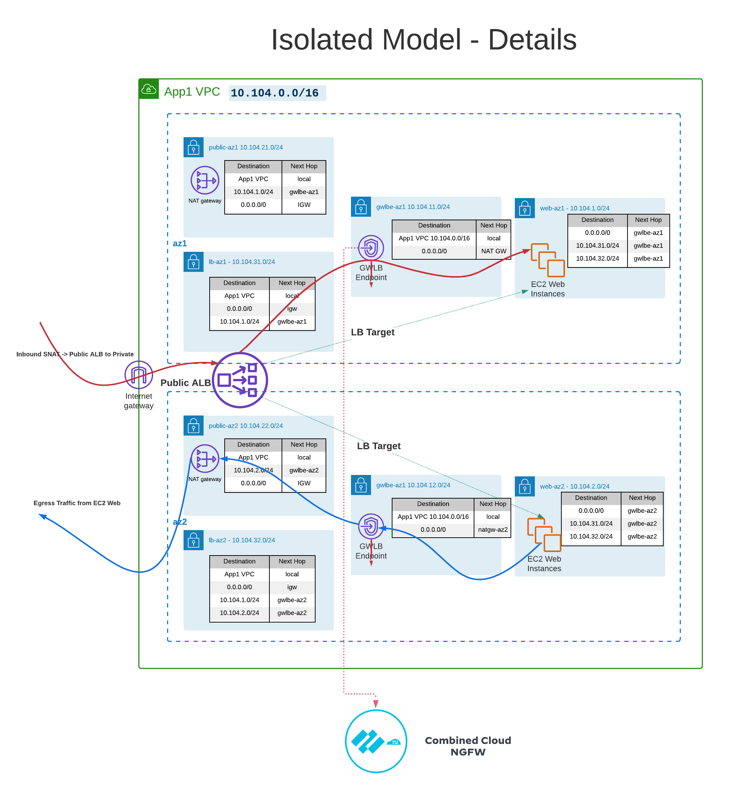

# Cloud NGFW for AWS + Strata Cloud Manager - Isolated Model Lab (Part 2)

> &#8505; This is Part 2, a self-contained lab. You deploy a new VPC and run its own Terraform independently of Part 1. Part 1 is needed for one thing only: its deployment profile, which you use to turn on Strata Cloud Manager Pro.

```
Manual Last Updated: 2026-06-24
```

## Lab Guide Syntax conventions

- Items with a bullet indicate actions to take to complete the lab.
- Code blocks follow an action for copy / paste or reference.

> &#8505; Items with the info icon are additional context or details around the actions.

> &#10067; Items with the question mark icon are good check-your-understanding questions.

## 1. Overview

In Part 1 you ran one firewall engine: VM-Series behind a Gateway Load Balancer, managed by Panorama. In this part you introduce a second engine, Palo Alto Cloud NGFW for AWS (a Palo Alto-operated managed firewall service), and you manage it from Strata Cloud Manager (SCM).

This lab uses the **isolated model**: the Cloud NGFW inspection endpoint lives in the same VPC as the application, and that VPC sends both its outbound traffic and its inbound (load-balanced) traffic through Cloud NGFW for inspection. No Transit Gateway, no separate security VPC. You will:

- Turn on Strata Cloud Manager Pro using your Part 1 deployment profile.
- Deploy a self-contained application VPC with Terraform, including a public Application Load Balancer in front of the app servers.
- Create an SCM-managed Cloud NGFW and insert it into the VPC's traffic path, inspecting both outbound and inbound flows with a single endpoint.
- Author SCM-native security rules for each direction and watch traffic get inspected.

| Choice | Part 1 (VM-Series) | This lab (Cloud NGFW) |
| --- | --- | --- |
| Firewall resource | VM-Series you run (EC2 + GWLB) | Cloud NGFW, a managed service |
| Endpoint placement | Centralized security VPC | Distributed: endpoint in the app VPC (isolated) |
| Management plane | Panorama | Strata Cloud Manager (SCM) |

> &#8505; The isolated model does not inspect east/west traffic between VPCs. That is expected; this lab is about getting one application VPC's outbound and inbound traffic inspected by a SaaS firewall you manage from SCM.

> &#8505; A later part of this lab (Part B) adds account onboarding, TLS decryption, and CloudWatch logging. The core lab here works **without** onboarding your account with cross-account IAM roles, which is a useful way to see what those roles do (and do not) gate.

## 2. Architecture

This lab inspects traffic in **both directions** with a **single** Cloud NGFW (Gateway Load Balancer) endpoint per Availability Zone.



Outbound (app servers reaching the internet):

```
Phase 1 (no firewall): app server -> NAT gateway -> IGW -> internet
Phase 2 (inserted):    app server -> Cloud NGFW endpoint -> [inspect] -> NAT gateway -> IGW -> internet
return:                internet -> NAT gateway -> Cloud NGFW endpoint -> [inspect] -> app server
```

Inbound (internet clients reaching the app through a public ALB):

```
Phase 1 (no firewall): client -> IGW -> ALB -> app server
Phase 2 (inserted):    client -> IGW -> ALB -> Cloud NGFW endpoint -> [inspect] -> app server
return:                app server -> Cloud NGFW endpoint -> [inspect] -> ALB -> IGW -> client
```

> &#8505; The firewall sits **behind** the ALB. The Application Load Balancer is the public entry point; it forwards to the web servers through the Cloud NGFW endpoint, so the firewall inspects the (cleartext) ALB-to-web traffic. The separate client-to-ALB leg is terminated by the ALB.

> &#8505; One endpoint handles both directions because the inbound hop the firewall inspects (ALB to web) stays inside the VPC. That leaves the endpoint subnet a single default route, out to the NAT gateway for outbound, with nothing to conflict over. Putting the firewall at the internet edge in front of the ALB would instead need a second endpoint, because outbound replies and inbound replies would want different default routes (NAT gateway vs IGW) in the same subnet.

> &#8505; Gateway Load Balancer requires the firewall to see both directions of a flow. Cloud NGFW does not source-NAT (egress NAT is not supported on SCM-managed firewalls), so the AWS NAT gateway does the NAT and the Terraform sets up the symmetric return routing for you. Cross-zone load balancing is disabled on the ALB so each inbound flow stays within one AZ and one endpoint.

> &#10067; Why can this design inspect both inbound and outbound with one GWLB endpoint, when inspecting internet-facing inbound traffic at the edge would need a second one?

## 3. Prerequisites

- Your own QwikLabs AWS account. This lab is built for `us-east-1`.
- Your Part 1 deployment profile (it carries a Strata Cloud Manager Pro entitlement).
- SCM access: your instructor's workshop parent tenant, where you activate your own child tenant.

## 4. Step 1 - Activate Strata Cloud Manager Pro from your deployment profile

You do not need the 30-day eval. Your Part 1 deployment profile already includes a Strata Cloud Manager Pro entitlement; you activate it onto your tenant.

- In the Customer Support Portal / hub, open your deployment profile and choose `Finish Setup`.
- On `Activate Subscriptions based on Deployment Profile(s)`, select your Customer Support Account.
- Under `Specify the Recipient`, select your tenant (your `*-swfw-lab` tenant under the workshop parent).
- Select your Region, then under `Select Deployment Profile(s)` choose your `*-swfw-workshop` profile (Strata Cloud Manager Pro).
- Review, agree to the Terms and Conditions, and choose `Activate`.
- Strata Cloud Manager begins provisioning on your tenant (`Initializing`, ~20 minutes). Continue to the next step while it finishes.

<!-- screenshots (clean versions to add): Finish Setup; recipient tenant; deployment-profile select; review+Activate; tenant SCM Initializing -->

> &#8505; The first Cloud NGFW resource you create later also upgrades the tenant with SCM Pro features for Cloud NGFW (~45-50 minutes), which runs in the background. You do not need to wait for it.

## 5. Step 2 - Deploy the lab infrastructure (Terraform, Phase 1)

Run Terraform from the QwikLabs Cloud Shell, the same way as Part 1.

<!-- WORKSHOP-TEMP: one-off note for this cohort run; remove when generalizing the lab -->
> &#9888; **For this workshop, open your Cloud Shell in `us-east-2` (Ohio), not `us-east-1`.** Part 1 already filled your `us-east-1` Cloud Shell storage (AWS gives only 1 GB of Cloud Shell home space **per region**), so running Part 2's `terraform init` there fails with a no-space error. Starting the shell in `us-east-2` gives you a clean 1 GB.
>
> **This changes only WHERE you run the commands. Every lab resource still deploys to `us-east-1`.** The region is pinned in `terraform.tfvars`, so leave `region` and `azs` exactly as they ship. Your Cloud NGFW, VPC, and app servers are all created in `us-east-1`.
>
> (If you would rather stay in the `us-east-1` shell, free space first with `find ~ -type d -name .terraform -prune -exec rm -rf {} +`, then continue.)
<!-- /WORKSHOP-TEMP -->

- Switch the AWS console **Region selector to `us-east-2` (Ohio)**, then open Cloud Shell.
- Clone the repo and install Terraform. This fresh `us-east-2` shell does not carry over the Terraform binary you installed in Part 1 (Cloud Shell storage is per-region), so install it again with the same one-liner as Part 1:

```
cd ~ && git clone https://github.com/PaloAltoNetworks/lab-aws-gwlb-vmseries.git
chmod +x ~/lab-aws-gwlb-vmseries/terraform/install_terraform.sh && ~/lab-aws-gwlb-vmseries/terraform/install_terraform.sh && source ~/.bashrc
```

- Verify Terraform, then change into the Cloud NGFW Terraform directory and create your tfvars:

```
terraform version
cd ~/lab-aws-gwlb-vmseries/cloudngfw-scm-isolated/terraform
cp example.tfvars terraform.tfvars
```

- Edit `terraform.tfvars`: set `name_prefix` to a short unique value (your initials). Leave `insert_cngfw = false` for now, and leave `region = "us-east-1"` and `azs` as they ship - your Cloud Shell may be in `us-east-2`, but the lab deploys to `us-east-1`.
- Deploy.

```
terraform init
terraform apply
```

- Note the outputs. You will need `gwlbe_subnet_az_ids` in the next step.

```
terraform output gwlbe_subnet_az_ids
```

- Confirm outbound works: connect with Session Manager (EC2 -> Instances -> select an app server -> Connect -> Session Manager) and run `curl -s https://ifconfig.me`. You should get a NAT public IP back (`terraform output nat_public_ips`).
- Confirm inbound works: `terraform output alb_dns_name`, then browse to `http://<alb_dns_name>/`. You should get the app's headers page.

> &#8505; In Phase 1 the app servers egress straight through the NAT and the ALB reaches them directly. This proves the application works in both directions before you insert the firewall, so when traffic changes later you know the firewall is the cause.

> &#9888; This QwikLabs account does not have the `AWS-RunShellCommand` SSM document, so use **Session Manager** (an interactive shell) for any on-box step in this lab, not SSM Run Command.

## 6. Step 3 - Create the Cloud NGFW resource in SCM

- In SCM: Configurations -> Cloud NGFWs -> Create Cloud NGFW.
- Select Cloud Provider: `Amazon Web Services`. The first time you will see `The environment setup has completed successfully`.
- General Info:
  - `Firewall Name`: a name with your prefix.
  - `Region`: `us-east-1`.
  - `Availability Zone IDs`: enter the IDs from `terraform output gwlbe_subnet_az_ids`. They must match the AZs your `gwlbe` subnets are in.
- Endpoint Management -> `Allowlisted AWS Accounts`: enter your AWS Account ID.
- Create and Deploy. The firewall shows `CREATING` for up to 10 minutes, then registers as a device in SCM.

<!-- screenshots (clean versions to add): Create Cloud NGFW wizard General Info; Creating Firewall notification -->

> &#8505; Allowlisting your account is all the core lab needs - it lets you create the Cloud NGFW endpoint in your VPC. Full account onboarding (the CloudFormation template that creates cross-account IAM roles) is a separate step covered in Part B; it is what enables decryption and CloudWatch logging, not basic inspection.

> &#8505; AZ names are per-account aliases; Cloud NGFW places its endpoints by physical AZ ID. The `gwlbe_subnet_az_ids` output gives you the exact IDs to paste, so you do not have to look them up by hand.

> &#10067; Why does Cloud NGFW ask for Availability Zone IDs instead of names?

## 7. Step 4 - Insert Cloud NGFW into the traffic path (Terraform, Phase 2)

- In the Cloud NGFW console, open your firewall and copy its GWLB endpoint **service name** (looks like `com.amazonaws.vpce.us-east-1.vpce-svc-...`).
- Edit `terraform.tfvars`:

**Make sure to remove the `#` comment from the lines**

```
insert_cngfw            = true
cngfw_gwlb_service_name = "com.amazonaws.vpce.us-east-1.vpce-svc-0123456789abcdef0"
```

- Re-apply.

```
terraform apply
```

This creates the Cloud NGFW endpoint in each `gwlbe` subnet and redirects the app subnets' egress, the inbound ALB-to-web hop, and both return paths through it.

> &#8505; The apply pauses for about 2.5 minutes after creating the endpoint. A GWLB endpoint returns from creation in a `pending` state, and AWS rejects a route to it until it is `available`. The Terraform waits this out for you (`gwlbe_route_delay`).

> &#9888; Cloud NGFW denies by default. The moment you insert it, both directions stop: the app servers lose outbound internet and the ALB page stops loading (its targets go unhealthy) until you add allow policy in the next step. That is expected. Session Manager keeps working - it reaches SSM through private VPC endpoints, so you keep your shell even while the data plane is denied.

> &#10067; At this exact moment (routes flipped, no policy yet), where would you see an app server's outbound request being dropped?

## 8. Step 5 - Author SCM policy and test

Policy for an SCM-managed Cloud NGFW lives in SCM-native security rules in a folder, not in Cloud NGFW rulestacks. The firewall denies by default, so both directions are blocked right now. You will add one rule per direction and watch each come back.

- Create a folder: SCM -> Workflows -> NGFW Setup -> Folder Management -> Add Folder (e.g. `aws-cloudngfw`), in `All Firewalls`.
- Move your firewall into the folder: Folder Management -> your firewall -> Actions -> Move.

Author the rules under Manage -> Configuration -> NGFW and Prisma Access -> Configuration Scope = your folder -> Security Services -> Security Policy -> Add Rule. Your app subnet CIDRs are `terraform output app_subnet_cidrs` (with the lab defaults, `10.104.1.0/24` and `10.104.2.0/24`).

Outbound rule, app servers reaching the internet:

  - `Name`: `allow-outbound-web`
  - `Source Zone`: `any` (required)
  - `Source Address`: your app subnets
  - `Destination Zone`: `any` (required)
  - `Destination Address`: `any`
  - `Application`: `web-browsing`, `ssl`, `dns`
  - `Service`: `application-default`
  - `Action`: `Allow`, log at session end

Inbound rule, internet clients reaching the app through the ALB:

  - `Name`: `allow-inbound-web`
  - `Source Zone`: `any` (required)
  - `Source Address`: `any`
  - `Destination Zone`: `any` (required)
  - `Destination Address`: your app subnets
  - `Application`: `web-browsing`
  - `Service`: `application-default`
  - `Action`: `Allow`, log at session end

- Push the configuration.

<!-- screenshots (clean versions to add): Add Folder; Folder Management move firewall; outbound Add Rule; inbound Add Rule; Push -->

> &#9888; SCM-managed Cloud NGFW rules must use `any` for source and destination zone. A real zone value silently drops traffic.

Test both directions:

- Outbound: from an app server (Session Manager), `curl -s https://ifconfig.me` and browse a few sites. You get a NAT public IP back. Session Manager stays connected throughout because it uses the private SSM VPC endpoints, independent of your firewall policy.
- Inbound: browse to `http://<alb_dns_name>/` (`terraform output alb_dns_name`). The app's headers page loads, served through the firewall.
- View logs: SCM -> Configurations -> Cloud NGFWs -> your firewall -> View Logs. You should see both the outbound and inbound sessions.

> &#8505; Add the rules one at a time and re-test in between. With only the outbound rule, `curl https://ifconfig.me` works but the ALB page does not; the inbound rule is what restores it. That is deny-by-default showing you exactly what each rule gates.

> &#10067; Your inbound rule leaves `Source Address` as `any`. What source does the firewall actually see for inbound traffic, the internet client or the ALB? The ALB is a Layer 7 proxy: the firewall inspects the ALB-to-web connection, so it sees the ALB's address. The original client IP survives only in the `X-Forwarded-For` header visible on the app's page.

> &#10067; Compare these session logs with the VM-Series traffic logs in Panorama from Part 1. What is the same, and what differs in how each engine is managed and logged?

## 9. What you built

You now have an application VPC whose **outbound and inbound** traffic is inspected by an SCM-managed Cloud NGFW, inserted as a single Gateway Load Balancer endpoint per AZ in the isolated model, with a security rule per direction authored in SCM-native policy. You did all of this with only your account **allowlisted** - no cross-account IAM roles.

## 10. Coming next (Part B): onboarding, decryption, and logging

The next part adds the cross-account IAM roles (via a CloudFormation template) and uses them to:

- **Decrypt** outbound TLS with a forward-proxy certificate (an SCM Cloud Certificate bound to an AWS Secrets Manager secret), so Cloud NGFW can inspect the payload, not just the handshake.
- **Forward logs** to CloudWatch (log groups `PaloAltoCloudNGFW` and `PaloAltoCloudNGFWAuditLog`) and publish metrics.

> &#8505; This is the natural place to see what the onboarding roles actually unlock: the core inspection above worked without them; decryption and CloudWatch logging do not.

## References

- *Cloud NGFW for AWS - Getting Started* (SCM onboarding, tenant V2, deployment-profile activation)
- *Cloud NGFW for AWS - Administration* (SCM policy management, certificates, decryption, logging)
- *Cloud NGFW for AWS - Deployment* (distributed / isolated architecture)
